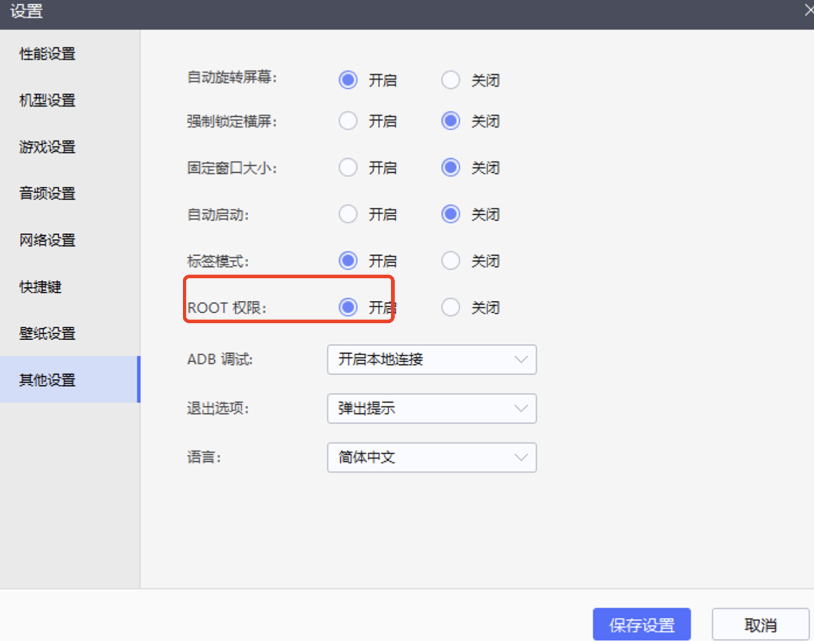
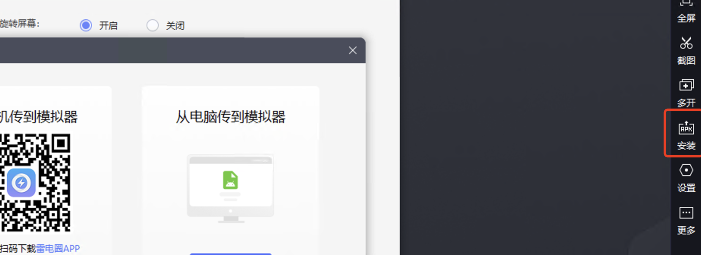
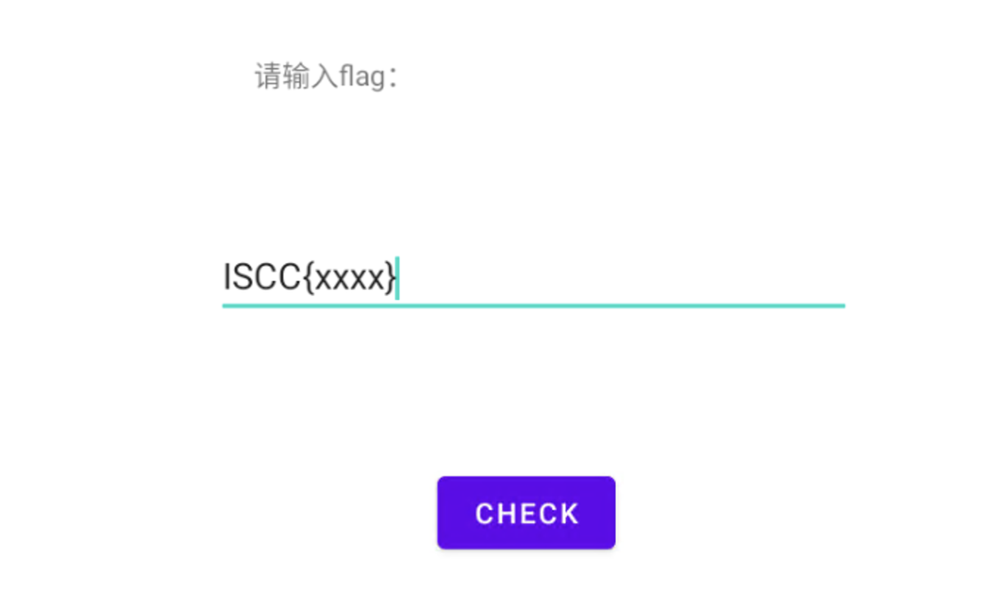

## Mobile_1

首先安装以下两个库

```
pip install frida
pip install frida-server
```

再安装雷电模拟器，安装成功之后。修改模拟器权限增加ROOT。



进入雷电模拟器的目录`xxx\leidian\LDPlayer9`,在该目录下打开cmd，执行如下命令判断adb是否可以使用。

```
adb devices
```


然后将`frida-server`移动到`adb push frida-server-16.2.1 /data/local/tmp`目录下.

执行以下命令：

```
adb shell
su
cd /data/local/tmp
./frida-server-16.2.1 &
```

在之后利用雷电模拟器安装apk，apk就是题目提供的附件



安装成功之后打开，首先执行以下python脚本

```python
import frida,sys
def on_message(message,dada):
    if message['type'] == 'send':
        print("[*] {0}".format(message['payload']))
    else:
        print(message)

#hook js
jscode = '''
    Java.perform(function(){
        
        var targetClass = Java.use('com.example.whathappened.a');
        
        var Receiver = Java.use('com.example.whathappened.Receiver');
        
        targetClass.a.implementation = function() {
            
            console.log('hack');
            var s = "04999999";
            var s1 = "gwC9nOCNUhsHqZm";
            var enc = Receiver.encrypt2(Receiver.encrypt(s, s1)).substring(0, 0x20);
            console.log(enc);
        }
    });
'''

# jscode = '''
#     Java.perform(function(){
#         var targetClass = Java.use('com.example.whathappened.a');
#         var Myjni = Java.use('com.example.whathappened.MyJNI.Myjni')
#         targetClass.a.implementation = function() {
#             console.log('hack');
#             var leak = Myjni.getstr();
#             console.log(leak);
#             return true;
#         }
#     });
# '''

# 启动方式1
process = frida.get_usb_device(-1).attach('Puzzle Game')
script = process.create_script(jscode)
script.on('message', on_message)
script.load()
sys.stdin.read()
#
# # 启动方式2 spawn 重启APP 可以hook APP启动阶段
# device = frida.get_usb_device(-1)
# pid = device.spawn(['3200'])
# process = device.attach(pid)
# script = process.create_script(test)
# script.on('message', on_message)
# script.load()
# device.resume(pid)
# sys.stdin.read()
```

在打开的apk中，输入以下内容：



点击check，之后查看python脚本的回显就行。