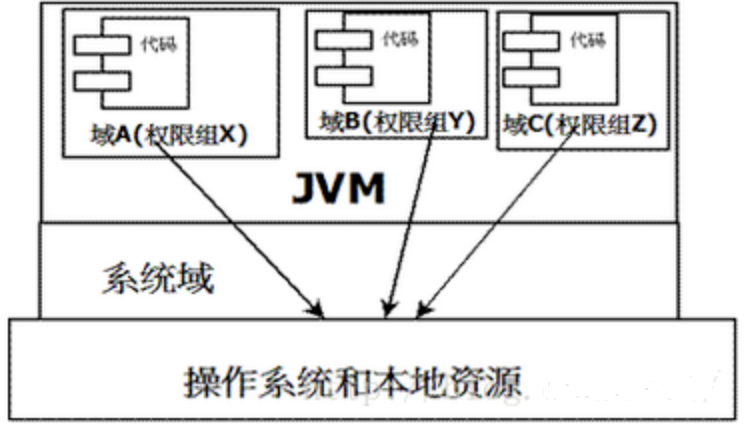
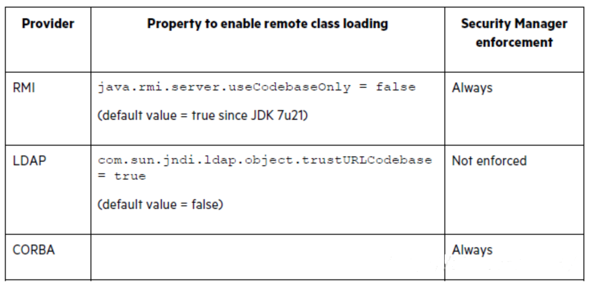

# JNDI总结

## 1.JNDI

**JNDI(Java Naming Direcorty Interface) Java命令和目录接口**：一组应用程序接口，为开发人员查找和访问各种资源提供了统一的通用接口，可以用来定义 用户、网络、机器、对象和服务等。

- JNDI支持的服务：
  - RMI
  - LDAP
  - DNS
  - CORBA

简单来说，JNDI是一组API接口，每个对象都有一组唯一的键值对绑定，将名字和对象进行绑定，通过名字来检索指定的对象而对象可能存储在RMI、LDAP、CORBA中。

- `Java Naming`
  - 命令服务式一种键值对的绑定，使得应用程序可以通过键名检索对应的值
- `Java Direcotry`
  - 目录服务式命令服务的自然拓展，区别在于：
    - 目录服务中，对象可以有属性。
    - 命令服务中，对象没有属性。
  - 根据这个特性，目录服务中可以根据属性检索对象。
- `Object Facotry`
  - `Object Factory`用于将`Naming Service`中储存的数据转换为Java中表达的数据，如：Java中对象或者Java中的基本数据类型，每一个`Service Probider`可能配有多个`Object Factory`

Java为了实现将Object对象存储在Naming和Direcotry服务下，提供了Naming Reference功能，对象可以通过绑定Reference存储在Naming或Direcotry服务下，在使用Reference时，可以直接将对象写入构造方法中，当被调用时，对象方法就会被触发。

重要的属性配置：

- `ClassName`
  - 远程加载需要使用类名
- `ClassFactory`
  - 加载class中的需要实例化类的名称
- `ClassFactoryLocation`
  - 远程加载类的地址，提供classes数据的地址也可以是，file、ftp、http等协议。

## 2.远程代码和安全管理器

### 2.1 Java中的安全管理器

- Java对象分为：
  - **远程对象**
    - 默认是不受信任的
  - **本地对象**
    - 默认是可信任的

当系统从远程服务器加载一个对象时，为了安全起见，JVM要限制该对象的功能(禁止对象访问本地的文件系统，这个功能在JVM中是依赖安全管理器实现的。)

如下图，JVM引入"域"的概念，在不同的域的部分代理来对各种需要的资源进行访问，存在于不同域的class文件就具有当前域的全部权限。

- 系统域
  - 专门负责与关键资源进行交互，应用域则通过系统域的部分代理来对各种需要的资源进行访问，存在于不同域的class文件就具有当前域的全部权限。
- 应用域
  - 通过系统域的部分代理来对各种需要的资源进行访问，存在于不同域的class文件就具有当前域的全部权限。

### 2.2 JNDI的安全管理器

对于加载远程对象，JNDI提供两种不同的安全控制方式。

对于`Naming Manager`来说，相对的安全管理器的规则比较宽泛，但对于`JNDI SPI`层会按照下面表格的规则进行控制。

### 2.3 JNDI协议动态转换

简单来说，不管是什么样的绑定，都可以通过ladp和rmi协议利用

## 3.JNDI注入

### 3.1 RMI攻击

### 3.2 ldap攻击

## 4.绕过高版本JDK