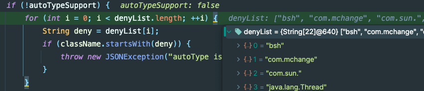

# FastJson1.2.25-1.2.48 反序列化分析

## 1.漏洞原理

由于自FastJson1.2.25版本之后，FastJson增加了黑白名单机制，如果想执行原来的利用链已经不行了，只能思考其它的方式。

## 2.漏洞分析

### 2.1 环境配置

```xml
<dependency>
    <groupId>com.alibaba</groupId>
    <artifactId>fastjson</artifactId>
    <version>1.2.25</version>
</dependency>
```

### 2.2 限制分析

当依赖版本为1.2.25及以上的时候，由于增加了白名单机制，原来的`Templates`类利用方式被限制了，只能寻找其它方式。在`ParserConfig#checkAutoType()`如下图



在上图中，存在一个字段`autoTypeSupport`，通过它来检查是否进行黑名单判断。那如果当启动该配置之后，是什么情况？

答案是会先进入白名单判断的逻辑，如下图：(有的文章写这是一种黑名单绕过方式？)


代码配置如下(这也就是为什么有些文章在调试的时候需要开启AutoTypeSupport)：

```java
ParserConfig.getGlobalInstance().setAutoTypeSupport(true);
ParserConfig.getGlobalInstance().addAccept("com.sun");
```

### 2.3 绕过分析

#### (1) `L 、;`绕过

##### 影响版本

##### 绕过分析

#### (2) 双写`L 、 ;`绕过(开启autoType)

##### 影响版本

##### 绕过分析

#### (3) `[`绕过(开启autoType)

##### 影响版本

##### 绕过分析

#### (4)内置JSON

##### 影响版本

##### 绕过分析

### 2.4 mappings缓存

#### (1) 漏洞分析

