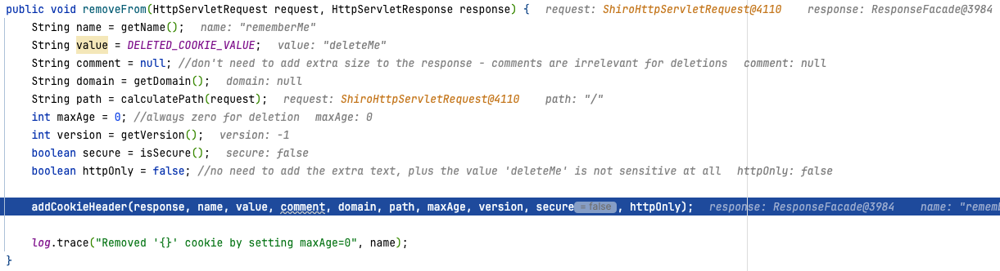
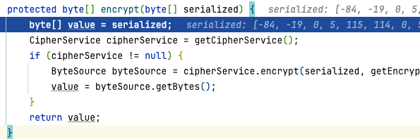
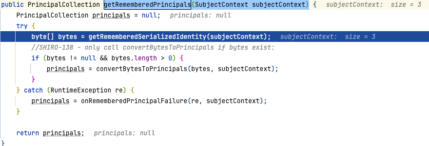
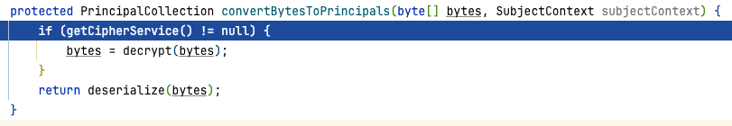

# Shiro反序列化漏洞

## 0x01 前言

Shiro-550反序列化漏洞大约在2016年就被披露了，但感觉直到近一两年，在各种攻防演练中这个漏洞才真正走进了大家的视野，Shiro-550反序列化应该可以算是这一两年最好用的RCE漏洞之一，原因有很多：Shiro框架使用广泛，漏洞影响范围广；攻击payload经过AES加密，很多安全防护设备无法识别/拦截攻击……

## 0x02 环境搭建

直接从github上clone代码到本地。

```txt
git clone https://github.com/apache/shiro.git
cd shiro
git checkout shiro-root-1.2.4
```

编辑shiro/samples/web目录下的pom.xml,将jstl的版本修改为1.2。

```xml
<dependency>
    <groupId>javax.servlet</groupId>
    <artifactId>jstl</artifactId>
    <version>1.2</version>
    <scope>runtime</scope>
</dependency>
```

## 0x03 漏洞分析

网上的分析文章都会直接告诉我们触发点在XXX，如果参考文章，那我们可能说找到触发点，然后往下跟就完事了。

这样看起来似乎我们好像学习到了，但是真的了解这个洞了吗？所以不妨从如何发现来分析出这个漏洞。

第一种方式就在于我们可以根据报错来进行分析，首先如果对与rememberMe该字段传输的内容中，如果存在一些异常的错误，会存在以下异常


那么根据这个报错链，我们需要定位到的就在于`createSubject(SubjectContext subjectContext)`,然后往下跟踪基本上就可以找到该反序列化链的触发。

### 3.1 加密过程

首先断点可以设置在`shiro/core/src/main/java/org/apache/shiro/subject/support/DelegatingSubject#login(AuthenticationToken token)`


继续往下跟着调用，到`shiro/core/src/main/java/org/apache/shiro/mgt/DefaultSecurityManager#login(Subject subject, AuthenticationToken token)`


往下调用到`onSuccessfulLogin(token, info, loggedIn);`,继续跟着调用就是到同一个类下的`onSuccessfulLogin(AuthenticationToken token, AuthenticationInfo info, Subject subject)`中，紧接着调用`rememberMeSuccessfulLogin(token, info, subject);`中。


根据上述代码，首先获取`CookieRememberMeManager`对象，当该类不为空，往下调用`onSuccessfulLogin(subject, token, info);`，该方法主要的代码为


通过forgetIndentity方法，对subject对象进行处理，该对象包含单个用户的状态和安全操作，其中包括认证、授权等等。那么我们有必要跟进这个方法分析处理方式。

获取请求包和响应包后，再次调用forgetIndentity方法，处理这两个获取到的包。


通过getCookie方法获取到cookie之后再通过removeFrom方法，在返回包中添加Set-Cookie: rememberMe=deleteMe



然后回到onSuccessfulLogin方法中，如果有设置rememberMe则进入rememberIdentity方法。


通过调用`convertPrincipalsToBytes`对用户名进行处理，然后调用serialize对用户名进行处理。


然后在serialize方法中，对于用户名再进行处理。


回到`convertPrincipalsToBytes`方法中，再对序列化的数据进行加密。跟进`encrypt(byte[] serialized)`中，通过加密算法为AES，模式为CBC，填充算法为PKCS5Padding



通过` getEncryptionCipherKey()`获取加密密钥，该密钥可以在`AbstractRememberMeManager.java`文件中看到。


返回到rememberIdentity方法中，跟进rememberSerializedIdentity方法中，然后将加密后的内容进行base64加密然后设置到cookie中。


然后就结束了。

### 3.2 解密过程

断点可以设置在`shiro/core/src/main/java/org/apache/shiro/mgt/AbstractRememberMeManager#getRememberedPrincipals(SubjectContext subjectContext)`中



首先通过`getRememberedSerializedIdentity`方法获取解码之后的值


获取密钥并且判断是否为空，如果不为空调用解密函数，对加密后的内容进行处理。



然后调用反序列化，需要注意的是这里的反序列化是有一些区别的，重写了ObjectInputStream


调用readObject也会进入resolveClass方法。


