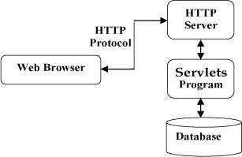
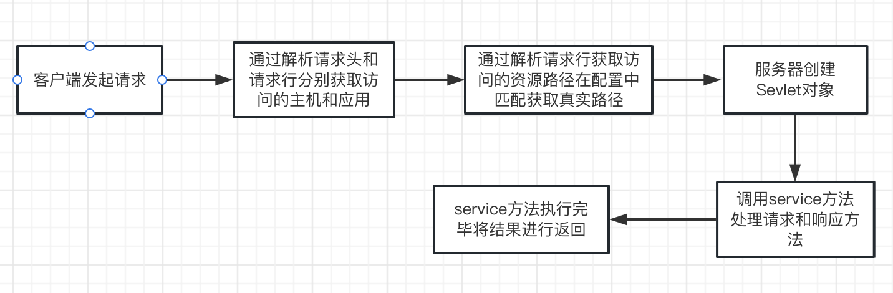
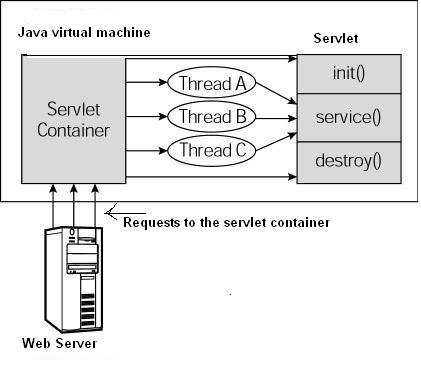
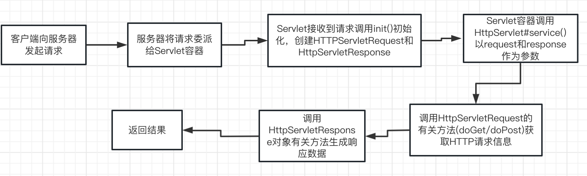
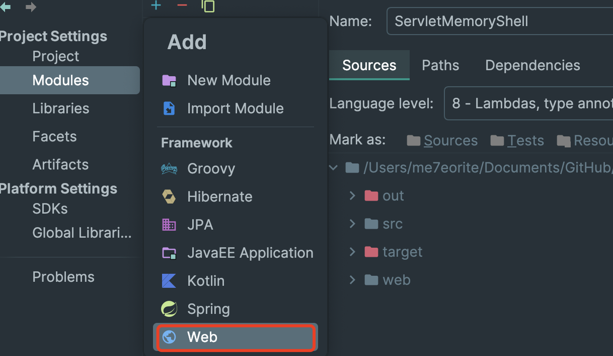
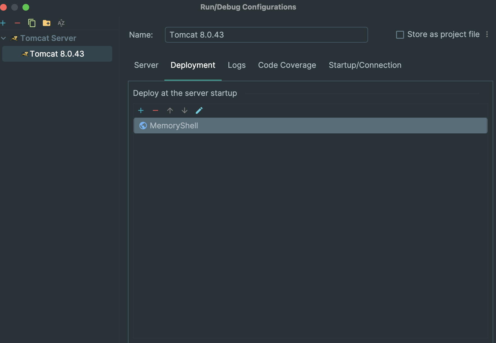

# Sevlet总结

## 1.Servlet是什么

### 1.1 Servlet简介

  Servlet(Server和Applet的缩写)，意思是**服务端小程序**。它使用Java语言编写，可生成动态的WEB页面。主要运行在服务端，作为来自Web浏览器和其它HTTP客户端的请求和HTTP服务器上的数据库或应用程序之间的**中间层**。

  **Servlet 实际上是一个Java类，其中没有main()方法**。**它的创建和销毁都是通过Servlet容器进行管理**。Servlet与HTTP协议紧密联系的，其可以处理HTTP协议相关所有内容。

### 1.2 Servlet架构



### 1.3 Servlet功能

- **读取**客户端发送的**显/隐式**的HTTP请求数据。
  - **显式数据**
    - 页面的HTML表单或者来自applet或者自定义HTTP客户端的表单。

  - **隐式数据**
    - cookies、媒体类型和浏览器能够理解的压缩格式。

- 处理读取的数据进行处理且生成结果。
  - 处理获取到的用户名和密码操作数据库获取用户数据并返回登陆结果

- **发送**隐/显式的HTTP响应/数据到客户端。
  - **显式数据**
    - 文本文件(HTML、XML)或者是二进制文件(图片)

  - 隐式数据
    - HTTP Headers、设置cookies、缓存参数


## 2.Servlet使用

### 2.1 Servlet运行流程

- 对HTTP请求进行解析：
  1. 通过**请求头**确认访问的的**主机**。

  1. 通过**请求行**确认访问的**应用**。

  1. 通过**请求行**获取访问的**资源路径**。

  1. 通过获取到的**资源路径**在配置中匹配到**真实的路径**。

  1. 服务器通过以上信息进行Servlet对象创建。

  1. 调用`service()`来处理请求和响应的操作

  1. 调用`service()`完成后返回服务器。有服务器将response缓冲区的数据取出，以http响应的格式发送给浏览器。




### 2.2 Servlet的生命周期

**Servlet对象**没有main()方法，不能独立运行，它的运行完全由**Servlet容器**来控制和调度。所谓生命周期，指的是Servlet容器**何时创建Servlet实例**、**何时调用**其方法请求的处理**何时销毁**其实例的整个过程。

- 以下是生命周期的存活过程:

  1. 实例和初始化的时机
     - 当请求达到容器时，容器查找该Servlet对象是否存在，如果不存在，则会创建实例并进行初始化

     2. 就绪/调用/服务阶段
        - 有请求到达容器，容器调用Servlet对象的service方法，出来了请求的方法在整个声明周期中可以被多次调用，HTTPServlet的service方法，会依据请求方法来调用doGet或者doPost方法。但是，这两个do方法默认情况下，会抛出异常，需要子类去override
     
  3. 销毁时机
     - 当容器关闭时，会将程序中的Servlet实例进行销毁


上述的生命周期可以通过Servlet中的声明周期方法来观察。在Servlet中有三个生命周期方法， 不由用户手动调用，而是在特定的时机有容器自动调用，观察这三个生命周期方法即可观察到Servlet的生命周期

以下是 Servlet 遵循的过程：

- Servlet 调用 **init ()** 方法进行初始化。
- Servlet 调用 **service()** 方法来处理客户端的请求。
- Servlet 调用 **destroy()** 方法终止（结束）。

最后，Servlet 是由 JVM 的垃圾回收器进行垃圾回收的。


现在让我们详细讨论生命周期的方法。

1. **实例和初始化**时机
   - 当请求达到容器时，容器查找该servlet对象是否存在，如果不存在，则会创建实例并进行初始化。

2. **就绪/调用/服务**阶段有请求到达容器
   - 容器调用servlet对象的service方法，HTTPServlet的service方法，会依据请求方法来调用doGet或者doPost方法。但是，这两个do方法默认情况下，会抛出异常，需要子类去重写。

3. **销毁**时机
   - 当容器关闭时，将程序中的Servlet实例进行销毁。

上述的生命周期可以通过Servlet中的声明周期方法来观察。在Servlet中有三个生命周期方法，不由用户手动调用，而是在特定的时机有容器自动调用，观察这三个生命周期方法即可观察到Servlet的生命周期。

#### 2.1 `Servlet`

```java
public interface Servlet {
  
    void init(ServletConfig var1) throws ServletException;

    ServletConfig getServletConfig();

    void service(ServletRequest var1, ServletResponse var2) throws ServletException, IOException;

    String getServletInfo();

    void destroy();
}
```

Servlet创建于用户第一次请求对应Servlet的URL也可以指定Servlet在服务器第一次启动的时候创建。

##### (1).`init()`

​     只在首次创建Servlet容器时调用，当容器创建后会自动生成实例，用户请求会产生一个线程，根据逻辑调用`doGet/doPost`方法,在方法中会创建和加载一些数据它们会被用于Servlet整个生命周期。

##### (2).`serivce()`

​     service方法是实际执行任务的主要方法，Servlet容器(Web服务器)调用`serivce()`方法处理客户端的请求，并把格式化的响应写给客户端。每次服务器接收到一个Servlet请求时，服务器会产生一个新的线程并调用服务。

​     service()方法检查HTTP请求类型(GET、POST、PUT、DELETE)，并适当的时候调用doGet、doPost、doPut、doDelete。

```java
void service(ServletRequest var1, ServletResponse var2) throws ServletException, IOException;
```

​     service()方法由容器调用，service方法在适当的时候调用doGet、doPost、doPut、doDelete等方法。所以不需要对service()进行操作，只需要根据客户端的请求类型来重些doGet和doPost。

##### (3) `doGet()`

```java
public void doGet(){HttpServletRequest request,HttpServletResponse response}throws ServletException,IOException{
	//....
}
```

##### (4) `doPost()`

```java
public void doPost(){HttpServletRequest request,HttpServletResponse response}throws ServletException,IOException{
	//....
}
```

##### (5) `destroy()`

```java
public void destroy(){
	//...
}
```

   `destroy()`只会被调用一次，在Servlet生命周期结束之后调用，它可以让Servlet关闭数据库连接、停止后台线程、将Cookie列表或者点击计数器写入到磁盘中，并执行其它类似的清理活动。

#### 2.2 架构



第一个到达服务器的HTTP请求被委派到Servlet容器中，Servlet容器调用`service()`之前加载Servlet，Servlet容器处理由多个线程产生的多个请求，每个线程执行单一的Servlet实例的`service()`方法.

### 2.3 具体工作流程

1. 客户端(浏览器)向服务器发送Http请求
2. 服务器将HTTP请求委派到Servlet容器中。
3. Servlet容器接收Web Client请求
4. Servlet容器创建一个HttpServletRequst对象，将客户端(浏览器)请求的信息封装到这个对象中
5. Servlet容器创建一个HttpSetvletResponse对象。
6. Servlet容器调用HttpServlet对象service方法， 把Request与Response作为参数，传给HttpServlet
7. HttpServlet调用HttpServletRequst对象的有关方法，获取Http请求信息
8. HttpServlet调用HttpServletResponse对象的有关方法，生成响应数据
9. Servlet容器把HttpServlet的响应结果传给客户端(浏览器)



## 3.HttpServlet

### 3.1 HttpServletRequest对象

主要作用是用来**接收客户端发送过来的请求信息**。例如:请求的参数，发送的头信息等都属于客户端发来的信息，service方法中形参接收的是HttpService接口的实例化对象，表示该对象主要应用在HTTP协议上，该对象是由Tomcat封装好传递过来的 

**HttpServlet是ServletRequest的子接口，ServletRequest只有一个子接口，就是HttpServletRequest。既然只有一个子接口为什么不将两个接口合并成一个？**

从长远上讲：现在主要用的协议是HTTP协议，但以后可能会出现更多的新协议，如果以后想要支持这种新协议只需要直接继承Servlet接口就行了

在HttpServlet接口中，定义了很多种方法，都是围绕客户端参数的，但是怎么拿到该对象呢？不需要，直接在Service方法中由容器传过来，我们需要做的就是取出对象中的数据，进行分析。

#### 1.1 接收请求

```java
System.out.println(req.getPathInfo());

//获取请求的完整url  项目名+serlvet
System.out.println(req.getRequestURI());

//获取请求的参数部分 参数名+参数值
System.out.println(req.getQueryString());

//获取请求的参数值
System.out.println(req.getParameter("name"));

//获取请求的方法GET/POST
System.out.println(req.getMethod());

//获取请求的协议/HTTP/1.1
System.out.println(req.getProtocol());
```

#### 1.2 请求乱码

tomcat 8 以上 GET传递中文不会乱码。POST会在请求之前加上语句：

```
req.setCharacterEncoding("utf-8");
```

#### 1.3 请求转发

请求转发是一种<span style='color:red;'>服务器行为</span>，当客户端请求到达后，服务器进行转发，此时会将请求对象进行保存，地址栏中的URL地址不会改变，得到响应后，服务器端在将响应发送给客户端，从始至终只有一个请求发出

```java
request.getRequestDispatcher(url).forward(request,response);
```

#### 1.4 request作用域

通过该对象可以在一个请求中传递数据，作用范围:在一次请求中有效，即服务器跳转有效

```java
//设置域对象内容
request.setAttribute(String name,String value)
//获取域对象内容
request.getAttribute(String name);
//删除域对象内容
request.removeAttribute(String name);
```

request域对象中的数据在一次请求中有效，则经过请求转发，request域中的数据依然存在，则在请求转发的过程中通过request来传输/共享数据。

### 3.2 HttpServletResponse对象

​	Web服务器收到客户端的http请求，会针对每一次请求，分别创建一个用于代表请求的request对象和代表响应的response对象。

​	request和response对象代表请求和响应：获取客户端数据，需要通过resquest的对象、向客户端输出数据，需要通过response对象

​	HttpServiceResponse的主要功能用于服务器对客户端的请求进行响应，将Web服务器处理后的结果返回给客户端。service方法中形参接收的是HttpServletResponse接口的实例化对象，这个对象中封装了向客户端发送数据、发送响应头、发送响应状态码的方法。

#### 2.1 响应数据

接收到客户端请求后，可以通过HttpServletResopnse对象直接进行响应

- 有两种形式:
  - `getWrite()`：<span style="color:red;">获取字符流（只能响应回字符）</span>
  - `getOutputStream()`:<span style="color:red;">获取字节流(能响应任意类型数据)</span>

响应的数据到客户端被浏览器解析.

注意:<span style="color:red;font-size:14px">两者不能同时使用</span>

```java
//输出字符流
PrintWriter writer = response.getWriter();
writer.write("hello");
writer.write("<h2>Hello</h2>");
```

```java
//输出字节流
ServletOutputStream out = response.getOutputStream();
out.write("hello".getBytes());
out.write("<h2>Hello</h2>".getBytes());
```

设置响应类型，默认是字符串.

#### 2.2 响应乱码 

​	在响应中，如果我们响应的内容中含有中文，则有可能出现乱码。这是因为服务器响应的数据也会经过网络传输，服务器端有一种编码方法，在客户端也存在一种编码方式，在客户端存在一种编码方法，当两端使用的编码方式不同时则出现乱码。

**`getWriter()`字符乱码**

对于`getWriter()`获取到的字符流，响应中文必定出现乱码，由于服务器端在进行编码时默认会使用ISO-8859-1格式的编码，该编码方式并不支持中文。

​	要解决这种乱码只能在服务器端**告知服务器**使用一种能够支持中文的编码格式，比如我们通常使用的“UTF-8”

```JAVA
response.setCharacterEncoding("UTF-8");
```

​	此时还只完成了一半的工作，要保证数据正确显示，还需要指定客户端的解码方式。

```java
resoponse.setHeader("content-type","text/html;charset=UTF-8");
```

两端指定编码后，乱码就解决了。一句话：<span style="color:red;">保证发送端和接收端的编码一致</span>

```java
//设置服务端的编码
response.setCharacterEncoding("UTF-8");
//设置客户端的响应类型及编码
response.setHeader("content-type","text/html;charset=UTF-8");
//得到字符输出流
PrintWriter writer = response.getWriter();
writer.write("<h2>你好<h2>")
```

#### 2.3 重定向

**重定向:**一种服务器指导，客户端的行为。客户端发出第一个请求，被服务器接收处理后，服务器会进行响应，在响应的同时，服务器会给客户端一个新的地址(下次请求的地址)，当客户端接收到响应后，会立刻、马上、自动根据服务器给的新地址发起第二个请求，服务器接收到请求并做出响应，重定向完成

​	从描述可以看出重定向当中有两个请求存在，并且属于客户端行为。

```java
//重定向跳转到index.jsp
resopnse.sendRedirect("index.jsp");
```

​	通过观察浏览器我们发现第一次请求获得的响应码为302，并且含有一个location头信息，并且地址栏最终看到的地址是和第一次请求地址不同的，地址栏已经发生了变化。

#### 2.4请求转发和重定向的区别


## 4.Servlet的简单实用(要继承HttpServlet)

### 4.1 简易Demo

```java
public class Main extends HttpServlet {

    private String message;

    //必要的初始化操作
    @Override
    public void init() throws ServletException {
        message = "Hello World!"; //
    }


    //@Override
    //protected void service(HttpServletRequest req, HttpServletResponse resp) throws ServletException, IOException {
      //  System.out.println(123);
    //}
    
    @Override
    protected void doGet(HttpServletRequest req, HttpServletResponse resp) throws ServletException, IOException {
        resp.setContentType("text/html");
        PrintWriter pw = resp.getWriter();
        pw.write(message);
    }

    @Override
    public void destroy() {
        super.destroy();
    }
}
```

重写`init()`可以实现我们需要的初始化操作，不重写的会也会调用父类中的`init()`,同样的其它两个方法也是类似的道理。

定义类之后需要通过web.xml指定访问的路由和处理的类

```xml
<?xml version="1.0" encoding="UTF-8"?>
<web-app xmlns="http://xmlns.jcp.org/xml/ns/javaee"
         xmlns:xsi="http://www.w3.org/2001/XMLSchema-instance"
         xsi:schemaLocation="http://xmlns.jcp.org/xml/ns/javaee http://xmlns.jcp.org/xml/ns/javaee/web-app_4_0.xsd"
         version="4.0">
    <servlet>
        <servlet-name>HelloWorld</servlet-name>
        <servlet-class>Main</servlet-class>
    </servlet>
    <servlet-mapping>
        <servlet-name>HelloWorld</servlet-name>
        <url-pattern>/hello</url-pattern>
    </servlet-mapping>
</web-app>
```


## 7.Cookie对象

Cookie是浏览器提供的一种技术，通过服务器的程序能够将一些只需保存在客户端，或者在客户端进行处理的数据，放在本地计算机上，不需要通过网络传输，因为提高网页的处理效率，并且能够减少服务器的负载，但是由于Cookie是服务器保存在客户端的信息，所以其安全性也是很差的。例如常见的记住密码则可以通过Cookie实现。

有一个专门操作Cookie的类`Javax.servlet.http.Cookie`.随着服务器端的响应发送给客户端，保存在浏览器。当下次再访问服务器时把Cookie在带回服务器

- Cookie格式:键值对用"="连接，多个键值对间通过`;`隔开

### 7.1 Cookie的操作

#### 1.1 Cookie的创建和发送

通过`new Cookie("key","value");`创建一个Cookie对象，要想将Cookie随响应发送到客户端，需要添加到response对象中，`response.addCookie(cookie)`.此刻该cookie对象则随着响应发送到客户端，在浏览器上可以看见。

```java
//创建Cookie对象
Cookie cookie = new Cookie("name","张三");
respon.addCookie(cookie);
```

##### 1.Cookie的路径

Cookie的setPath设置cookie的路径，这个路径直接决定服务器的请求是否会从浏览器中加载某些cookie

1.当前服务器任何项目任意资源都可以获取Cookie对象

```java
Cookie cookie = new Cookie("name","admin");
cookie.setPath(“/”);
response.addCookie(cookie);
```

2.当前项目下的资源可获取Cookie对象(默认不设置Cookie的path)**（默认）**

```java
Cookie cookie = new Cookie("name","admin");
cookie.setPath("/s01");
response.addCookie(cookie);
```

3.指定目录下的资源可获取Cookie对象

```java
Cookie cookie = new Cookie("name","admin");
cookie.setPath("/s01/cook01");
response.addCookie(cookie);
```

#### 1.2 Cookie的获取

在服务器端只提供一个`getCookies()`的方法用来获取客户端传的所有cookie组成的一个数组，如果需要获取单个cookie则需要通过遍历，getName获取Cookie的名称，getValue获取Cookie的值

```java
//获取Cookie数组
Cookie[] cookies = request.getCookies();
//判断数组是否为空
if(cookies !=null && cookies.length>0){
	//遍历Cookie数组
	
}
```

#### 1.3 Cookie设置到期时间

```java
cookie.setMaxAge(60*60*24);//设置最长的有效期为24小时。
cookie.setMaxAge(0);//同样的也可以删除cookie
```


### 7.2 Cookie注意点

​	Cookie 保存在浏览器中

​	在一般的站点中常常有记住用户名的操作，该操作只是将信息保存在本机上，换电脑以后这些信息就无效了，而且cookie还不能跨浏览器

​	Cookie存中文问题：

​		cookie中不能出现中文，如果有中文则通过`URLEncoder.encode()`来进行编码，获取时通过`URLDncoder.decode()`来进行解码

```java
String name = "姓名";
String value = "张三";
//通过URLEncode.encode()来进行编码
name = URLEncoder.encode(name);
value  = URLEncoder.decode(value);
//创建Cookie对象
Cookie cookie = new Cookie(name,value);
//发送Cookie对象
response.addCookie(cookie);
```

```java
//获取时通过URLDecode.decode()来进行检测
URLDecoder.decode(cookie.getName());
URLDecoder.decode(cookie.getValue ());
```

同名Cookie问题

如果服务器端发送重复的Cookie那么会覆盖原来的Cookie

浏览器存放cookie的数量 

不同的浏览器对Cookie也有限定，Cookie的存储是有上限的.Cookie是存储在客户端的，而且一般都是服务器创建和设定的，后期结合session来实现回话跟踪。

## 8.HttpSession对象

HttpSession对象是javax.servlet.http.HttpSession的实例，该接口并不想HttpServletRequet或HttpServletResponse还存在一个父接口，该接口只是一个纯粹的接口。这是因为session本身就属于Http协议的范畴。

对于服务器而言，每一个连接到它的客户端都是一个session，servlet容器使用此接口创建HTTP客户端和HTTP服务器之间的会话。会话将保留指定的时间段，跨多个连接 或来自用户的页面请求。一个会话通常对应于一个用户，该用户可能多次访问一个站点。可以通过此接口查看和操作有关某个会话的信息，比如会话标识符、创建时间和最后一次访问时间。在整个session中，最重要的就是属性操作。

session无论客户端还是服务器端都可以感知到，若重新打开一个新的浏览器，则无法取得之前设置的session，因为每一个session只保存在当前的浏览器中，并在相关的页面获得。

session的作用就是为了标识一次会话，或者确认一个用户；并且在一次会话(一个用户的多次请求)期间共享数据。我们可以通过`request.getSession()`方法,来获取当前会话的session对象。

```java
//常见session对象
HttpSession session  = request.getSession();
session.setAttrivute("name","values");

```

### 8.1 标识符JSESSIONID

Session既然是为了标识一次会话，那么此次会话就应该有一个唯一的标志，这个标志就是sessionId。

每当一次请求到达服务器，如果开启了会话(访问了session)，服务器第一步会查看是否从客户端回传一个名为JSESSIONID的cookie，如果没有则认为这是一次新的会话，会创建一个新的session独享，并用唯一的sessionid为此次会话做一个标志。如果有JESSIONID这个cookie回传，服务器则会根据JSESSIONID这个值去查看是否会有id为JSESSION值得session对象，如果没有则认为是一个新的会话，重新创建一个新的session对象，并标志此次会话；如果找到了相应的session对象，则认为是之前标志过的一次会话，返回该session对象，数据达到共享。

这里提到一个叫做JSESSIONID的cookie，这里一个比较特殊的cookie，当用户请求服务器时，如果访问了session，则服务器会创建一个名为JSESSIONID，值为获取到的session(无论是获取到的还是新创建的)的sessionid的cookie对象，并添加到response对象中，响应给客户端，有效时间为关闭浏览器.所以Session的底层依赖Cookie实现的。

### 8.2 session域对象

​	Session用来表示一次会话，在一次会话中数据时可以共享的。这是session作用域对象存在，可以通过`setAttribute(name,value);`方法同域对象中添加数据，通过`getAttribute(name)`从域对象中获取数据，通过`removeAttribute(name);`从域对象中移除数据。

```java
//获取session对象
HttpSession session = request.getSession();
//设置session域对象
session.setAttribute("name","admin");
//获取指定名称的session域对象
String name = (String)request.getAttribute("name");
//移除指定名称的session域对象
session.removeAttrbute("name");
```

数据存储在session域对象中，当session对象不存在了，或者是两个不同的session对象时，数据也就不能共享了，这就不得不谈到session的声明周期。

### 8.3 session对象的销毁

#### 8.3.1 默认时间到期

当客户端第一次请求servlet并且操作session时，session对象生成，Tomcat中session默认的存活时间为30m，即你不操作界面的时间，一旦有操作，session会重新计时。

- **那么session的默认时间可以修改吗**？
  - 可以在Tomcat中的conf目录下的web.xml文件中修改

```java
<session-config>
    <session-timeout>30</session-timeout>
</session-config>
```

#### 8.3.2 自己设定到期时间

​	当然除了以上的修改方式外，我们也可以在程序中自己设定session的生命周期，通过

```java
session.setMaxInactiveInterval(15);
```

### 8.3.3 立即失效

​	或者我们也可以通过`session.invalidate()`方法让session立即失效

```java
session.invalidate();
```

### 8.3.4 关闭浏览器

​	从前面的JESSIONID可知，session底层是依赖cookie实现的，并且cookie的有效时间为关闭浏览器，从而session在浏览器关闭时也相当于失效了。

### 8.3.5 关闭服务器

当关闭服务器时，session销毁

Session失效意味着此次会话结束，数据共享结束。

## 9.ServletContext对象

每一个Web应用都有且仅有一个ServletContext对象，又称Application对象。从名称可知，该对象是与应用程序相关的，在Web容器启动的时候，会为每一个WEB应用程序创建一个对应的ServletContext对象。

- 该对象的两大作用
  - 作用域对象用来共享数据，此数据在整个应用中共享
  - 该对象中保存了当前应用程序相关信息。例如，可以使用一下两种方法获取信息。
    - `getServletinfo()`**方法获取当前服务器信息**
    - `getRealPath(String path)`**获取项目资源的真实路径**

### 9.1 ServletContext对象的获取

通过request对象获取

```java
ServletContext servletContext = request.getServletContext();
```

通过session对象获取

```java
ServletContext servletContext = request.getSession().getServletContext();
```

```java
protected void service(HttpServletRequest req, HttpServletResponse resp) throws ServletException, IOException {
    //通过request获取
    ServletContext servletContext = req.getServletContext();

    //通过session获取
    ServletContext servletContext01= req.getSession().getServletContext();

    //通过getservletconfig获取
    ServletContext servletContext2 = getServletConfig().getServletContext();

    //通过servletContext获取
    ServletContext servletContext3 = getServletContext();

    //常见用途

    //获取服务器中间件版本信息
    String info =servletContext3.getSeårverInfo();
    System.out.println("服务器信息: "+info);
    String path = servletContext3.getRealPath("/");
    System.out.println("真实路径信息: "+path);
}
```

## 8.文件上传和下载

#### 8.1.1 前端页面

上传文件的时候都会有一个可视化页面，使用的请求方法为POST。代码如下：

```html
<body>
    <form action="uploadServlet" method="post" enctype="multipart/form-data">
        姓名:<input type="text" name="name">
        文件:<input type="file" name="myfile">
        <button>提交</button>
    </form>
</body>
```

后端代码：

```java
package com.example.demo14;

import javax.servlet.ServletException;
import javax.servlet.annotation.MultipartConfig;
import javax.servlet.annotation.WebServlet;
import javax.servlet.http.HttpServlet;
import javax.servlet.http.HttpServletRequest;
import javax.servlet.http.HttpServletResponse;
import javax.servlet.http.Part;
import java.io.IOException;

@WebServlet("/uploadServlet")
@MultipartConfig
public class Servlet14 extends HttpServlet {
    @Override
    protected void service(HttpServletRequest req, HttpServletResponse resp) throws ServletException, IOException {
        req.setCharacterEncoding("UTF-8");

        String name = req.getParameter("name");
        System.out.println("姓名:"+name);

        Part part = req.getPart("myfile");
        String filename = part.getSubmittedFileName();
        if(filename !=null && !filename.equals("")){
            String path = getServletContext().getRealPath("/upload/");
            part.write(path+filename);
        }
    }
}
```

## 8.2 文件下载

### 8.2.1 超链接下载 

当我们在HTML中或JSP页面使用a标签时，原意是希望能够进行跳转，但当超链接遇到浏览器不识别的资源时会自动下载，当遇到浏览器能够直接显示的资源时，浏览器会直接显示出来，比如txt、png、jpg等等。当然我们也可以通过download属性规定浏览器下载，但是有些浏览器不支持。

默认下载

```java
<!-- 当超链接遇到浏览器不识别的资源时，会自动下载 -->
<a href= “test.zip">超链接下载</a>
```

指定download下载

```java
<-- 当连接遇到浏览器识别的资源时，默认不会下载，通过download属性可以进行下载-->
<a href = "text.txt" download>超链接下载</a>
```

download属性可以不写任何信息，会自动使用默认文件名。

如果设置了download属性的值，则使用设置的值作为文件名，浏览器点击链接的时候会直接下载文件。

## 9. Java Web项目创建

利用Idea的Maven项目的quickstart创建一个项目，编写Servlet类之后，创建一个war，如下：


然后在Modules中加入web模块。



然后新增一个Tomcat Server，并且进行如下配置



## 参考文章

[Servlet和Servlet容器区别](https://blog.csdn.net/weixin_56587974/article/details/133711491)
