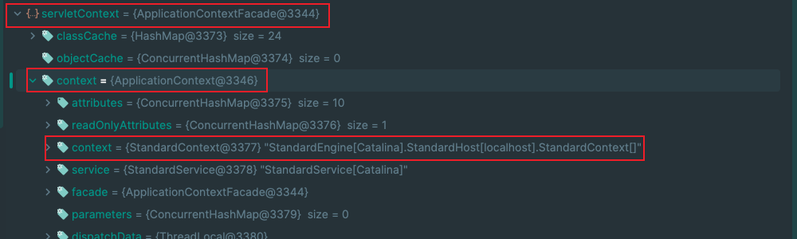

# Tomcat架构分析

## 1.Tomcat架构

Tomcat实现的两个核心功能：

- socket连接处理，负责网络字节流与Request、Response对象的转化

- 创建与管理Servlet，以及处理具体的Request请求

基于以上两点功能，Tomcat设计两个核心的组件:

1. 连接器(Connecter)
2. 容器(Container)

连接器负责对外交流，容器负责内部处理，同时 Tomcat 为了实现支持多种IO模型和应用层协议，多个连接器对应一个容器。


1. Server 对应一个Tomcat实例
2. Service 默认只有一个，一个 Tomcat 实例默认一个 Service
3. 一个 Service 可能多个连接器，接收不同的连接协议
4. 多个连接器对应一个容器，顶层容器为 Engine

### 1.1 Connecter

连接器对Servlet容器屏蔽了网络协议与IO模型的区别，无论是HTTP协议或者AJP协议，在容器中获取到的都是一个标准的ServletRequest对象。

其中，以三个组件来设计连接器，如下：

1. EndPoint
   - 负责网络通信，将字节流传递给Processor
2. Processor
   - 负责处理字节流生成 Tomcat Request 对象，将该对象传递给Adapter
3. Adapter
   - 负责将 Tomcat Request对象转成 ServletRequest 对象，传递给容器


### 1.2 Container

Connector连接器负责外部交流，Container容器负责内部处理，也就是说连接器处理Socket通信和应用层协议的解析得到ServletRequest，而容器负责处理ServletRequest。

Tomcat设计四种容器,它们之间并不是互相独立而是父子关系，如下：

1. Engine(org.apache.catalina.core.StandardEngine)
   - 最顶层容器组件，能够包含多个Host
2. Host(org.apache.catalina.core.StandardHost)
   - 代表虚拟主机，每个虚拟主机与一个域名相对应，能够包含多个Host
3. Context(org.apache.catalina.core.StandardContext)
   - 一个Context对应于一个Web应用，能够包含多个Wrapper，
4. Wrapper(org.apache.catalina.core.StandardWrapper)
   - 一个 Wrapper 对应一个 Servlet ，负责管理 Servlet ，包括 Servlet 的装载、初始化、执行以及资源回收。


#### (1) Servlet与Servlet容器

> - Servlet:
>   1. Servlet是Java编写的服务器端程序，用于处理来自客户端的请求和生成响应。
>   2. Servlet通常扩展了javax.servlet.Servlet接口，它必须实现service方法以响应HTTP请求。
>   3. Servlet可以处理各种类型的HTTP请求，如GET、POST、PUT、DELETE等，也可以用于处理其他协议的请求。
>   4. Servlet是Web应用程序的一部分，它们可以被部署在Servlet容器中，以处理特定的URL路径或请求。
>
> - Servlet容器 (也称为Web容器或Servlet引擎):
>   1. Servlet容器是一个Web服务器或应用服务器的一部分，用于管理和执行Servlet。
>   2. 它负责接收客户端请求，解析HTTP请求，确定应该调用哪个Servlet来处理请求，并将响应发送回客户端。
>   3. Servlet容器提供了一系列的服务，包括线程管理、生命周期管理、会话管理、安全性等，以支持Servlet的执行。
>   4. 常见的Servlet容器包括Tomcat、Jetty、WebLogic、WebSphere等。
>
> 总之，Servlet是编写用于处理请求和生成响应的Java类，而Servlet容器是一个运行这些Servlet的环境，它提供了许多基础设施和服务来管理Servlet的生命周期和处理请求。Servlet容器负责将客户端请求分派给适当的Servlet，并将响应返回给客户端，从而构成了Java Web应用程序的基本架构。
>
>  二、当想象Servlet和Servlet容器时，可以将其类比为餐厅服务过程：
> 	Servlet：想象Servlet就像餐厅的厨师。厨师负责根据客人的点菜（HTTP请求）准备食物（生成HTTP响应）。他们是餐厅的关键部分，因为他们知道如何烹饪不同类型的菜肴，并为客人提供所需的食物。
>
> ​	Servlet容器：Servlet容器就像整个餐厅或餐厅的管理者。容器提供了一个完整的环境，用于管理厨师（Servlet）的工作以及为客人（浏览器）提供服务。容器接受客人的点菜（HTTP请求），交给会做相应菜品的厨师（Servlet）来处理，之后客人的食物（HTTP响应）按照餐桌号送到桌上。容器还提供了一些餐厅的基础设施，如清洁、安全和座位分配等。
>
> 在这个比喻中，厨师是Servlet，负责处理客人的请求并准备响应。Servlet容器是整个餐厅的管理者，负责协调厨师的工作并确保一切顺利运行，以便为客人提供良好的用餐体验。这个比喻帮助解释了Servlet和Servlet容器之间的关系和各自的角色。
>
> ​													                   来自 -- [Servlet和Servlet容器区别](https://blog.csdn.net/weixin_56587974/article/details/133711491)

## 2.Context

### 2.1 关于Context

Context 实际上就是拥有当前中间件或框架处理请求、保存与控制Servlet、Filter对象等功能的实例。

Tomcat中存在三种Context，分别如下：

1. ServletContext(接口)
   - `ApplicationContextFacade` 是 `ServletContext` 接口的实现类，该类提供 Web 应用所有Servlet的视图，可以对某个Web应用的各种资源和功能进行访问。
2. ApplicationContext(接口)
   - ApplicationContext 也是对 ServletContext 接口的实现类，该类被包装在ApplicationContextFacade类。
3. StandardContext
   - `org.apache.catalina.Context` 接口的默认实现为 `StandardContext` ，且 Context 在 Tomcat 中代表一个 Web 应用 。

其结构如下图所示：



简而言之，ApplicationContext 所实现的方法都是调用 StandardContext 中的方法，StandardContext 是 Tomcat 中真正起作用的 Context 。

### 2.2 获取Context

理解上述提到的概念，大概能够明白向各种中间件和框架注入内存马的基础，就是需要获取到 Context。

#### (1).已有request对象

```java
ServletContext servletContext = request.getSession().getServletContext();

Field ApplicationContextFacadeField = ApplicationContextFacade.class.getDeclaredField("context");
ApplicationContextFacadeField.setAccessible(true);
ApplicationContext applicationContext = (ApplicationContext) ApplicationContextFacadeField.get(servletContext);

Field applicationContextField = ApplicationContext.class.getDeclaredField("context");
applicationContextField.setAccessible(true);
StandardContext standardContext = (StandardContext) applicationContextField.get(applicationContext);
```

#### (2).适用于 6<=Tomcat <=8 的获取方式

https://myzxcg.com/2021/10/Tomcat-%E6%9E%B6%E6%9E%84%E4%B8%8EContext%E5%88%86%E6%9E%90/#contents:%E4%BB%8Ehttp%E8%AF%B7%E6%B1%82%E5%88%B0servlet

#### (3).适用于 7<=Tomcat <=9 的获取方式


#### (4).适用于 8<=Tomcat <=9 的获取方式


## 3.Servlet容器定位

### 3.1 定位流程

> Tomcat设计了这么多个容器，在多个容器组件组合使用的时候，又是怎么的确定请求到达的是哪个Wrapper容器中的Servlet来处理的？
>
> 我们平时在请求Web应用时都是以URL的，例如 https://www.xxx.com/user/info。其实可见每一个请求的URL都会被映射定位到一个Servlet，这就是Tomcat中Mapper组件来完成此任务的。
>
> Mapper的工作原理：Mapper里保存了Web应用的配置信息，就是**容器组件与访问路径的映射关系**。例如Host容器里配置的域名、Context容器里的Web应用路径，以及Wrapper容器里Servlet映射的路径，这些配置信息就是一个多层次的Map。
>
> 当一个请求到来时，Mapper组件通过解析请求的URL，再到自己保存的Map里面去找，就能定位到一个Servlet，一个URL请求最后只能定位到一个Wrapper容器，也就是Servlet。
>
> 
>
> **1、根据协议和端口号选定 Service 和 Engine。**
>
>    我们知道 Tomcat 的每个连接器都监听不同的端口，比如 Tomcat 默认的 HTTP 连接器监听 8080 端口、默认的 AJP 连接器监听 8009 端口。上面例子中的 URL 访问的是 8080 端口，因此这个请求会被 HTTP 连接器接收，而一个连接器是属于一个 Service 组件的，这样 Service 组件就确定了。我们还知道一个 Service 组件里除了有多个连接器，还有一个容器组件，具体来说就是一个 Engine 容器，因此 Service 确定了也就意味着 Engine 也确定了。
>
> **2、根据域名选定 Host。**
>
>    Service 和 Engine 确定后，Mapper 组件通过 URL 中的域名去查找相应的 Host 容器，比如例子中的 URL 访问的域名是`user.shopping.com`，因此 Mapper 会找到 Host2 这个容器。
>
> **3、根据 URL 路径找到 Context 组件。**
>
>    Host 确定以后，Mapper 根据 URL 的路径来匹配相应的 Web 应用的路径，比如例子中访问的是 /order，因此找到了 Context4 这个 Context 容器。
>
> **4、根据 URL 路径找到 Wrapper（Servlet）。**
>
>    Context 确定后，Mapper 再根据 web.xml 中配置的 Servlet 映射路径来找到具体的 Wrapper 和 Servlet。
>
> ​														来自 --- [Tomcat中Servlet容器的设计原理](https://www.maishuren.top/archives/tomcat-zhong-servlet-rong-qi-de-she-ji-yuan-li)

### 3.2 定位原理


