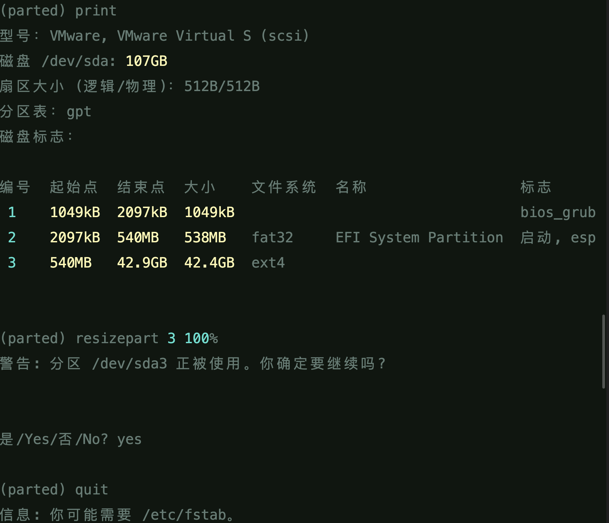

# 虚拟机问题

## 1.右上角网络图标消失且无网络

```
sudo service NetworkManager stop
rm -rf /var/lib/NetworkManager/NetworkManager.state
sudo service NetworkManager start
```


## 2.debian换源

debian linux 9

```
deb http://archive.debian.org/debian/ stretch main contrib non-free
deb-src http://archive.debian.org/debian/ stretch main contrib non-free
deb http://archive.debian.org/debian-security/ stretch/updates main contrib non-free
deb-src http://archive.debian.org/debian-security/ stretch/updates main contrib non-free
deb http://archive.debian.org/debian/ stretch-backports main contrib non-free

```


## 3.虚拟机扩容

首先，关机删除所有快照，然后开启配置，选择磁盘，扩容



然后可以执行`fdisk -l`确认一下磁盘有没有分配成功，成功了之后，执行`resize2fs /dev/sda3s`


