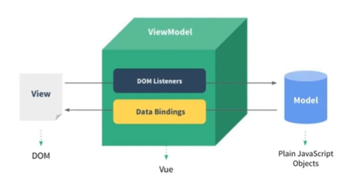

## 1.开发环境


## 2.小案例

1.阻止vue在启动时生成生产提示

```vue
Vue.config.productionTip = false //阻止vue在启动时生成生产提示
```

2.使用Vue的话，必须创建Vue实例，且传入一个配置对象，如下：

```html
<script type="text/javascript">
  	const x = new Vue({
      	el: "#root",  //用于指定当前生成的Vue实例绑定在哪个容器上。
        data: { //数据
          name: "xxx",
          ...
        }
    })
</script>
```

如上代码所示，必须有存在一个id指定为root(也可以是其它名称)的div容器,代码形式依然符合HTML规范，但可以引入一些Vue的语法（数据绑定等）。

3.容器与实例之间是一一对应的，重复定义无效。

## 2.模板语法

### 2.1 插值语法

功能：用于解析标签体内容

写法:`{{xxx}}`，其中括号里的内容是js表达式，能够直接读取到data的所有属性

### 2.2 指令语法

功能：用于解析标签(包括：标签属性、标签体内容、绑定事件等)

语法：

​    1.`v-bind:href='xxx'`

​    2.`:href='xxx'`(简写形式)

```html
<a v-bind:href='xxx'>点我xxx</a>
<a :href='xxx'>点我xxx</a>
```

其中xxx也是写js表达式且可以直接读取到data中的所有属性。Vue中有需要指令，形式都为:v-???。

### 2.3 data属性

如果出现值定义的name重复情况，那可以再创建一个属性的形式,如下：

```html
data:{
	name:'Vue',
	school:{
		name: 'Note'
	}
}
```

## 3.数据绑定

### 3.1 单向数据绑定

```html
单向数据绑定: <input type="text" v-bind:value="name"/>
```

数据只能从data流向页面。

### 3.2 双向数据绑定

```
双向数据绑定: <input type="text" v-model:value="name"/>
```

`v-model`：只能用于输入类元素（多选、单选、输入框）属性上，在页面中修改数据后，属性值也会相应修改。

`v-model:value`可以简写为`v-model`，由于`v-model`默认收集的就是value值。

## 4.el与data的两种写法

### 4.1 实例绑定容器写法

1.`el: '#root'`

2.`v.$mount('#root')` 将数据挂载到容器中

### 4.2 数据的两种声明方式

1.**data属性直接赋值**

```html
data:{
	name: "xxxx"
}
```

2.**函数式**

```html
data: function(){
  console.log('@@@',this);//this是Vue实例对象
  return {
        name: 'Vue'
    }
}//在后续会用得多
======================
data: ()=>{ //不要用
	console.log('@@@',this);//this为window

}
```

## 5.MVVM模型

- MVVM模型
  - M:模型(Model)
    - 对应data中的数据
  - V:视图(View)
    - 模板
  - VM:视图模型(ViewModel)
    - Vue实例对象



总的来说就是：数据通过vue传递到view中并通过渲染显示给用户。

## 6.数据代理

### 6.1 Object.defineproperty()

```js
let number = 18;
let person = {
	name: 'Vue',
	sex: 'Man'
}
Object.defineProperty(person,'age',{
  value: 18,
  enumerable: true, //控制属性是否可以枚举，默认为false
  writable: true, // 控制属性是否可以被修改，默认为false
  configurable: true //控制属性是否可以被删除，默认为false
  get: function(){
  	return number
})
```

通过它定义的属性是无法被遍历(枚举)到的,例如：`Object.keys(person)`获取的结果为`['name','sex']`. 同时上述列举了几个重要的配置，通过它们可以控制该属性的某一些特性。

主要的特性在于，该函数是具有`getter`与`setter`特性的使用，如下：

```js
Object.defineProperty(person,'age',{
    get(){
        return number;
    },
    set(value){
        console.log("修改number")
        number = value
    }
})
```

当我们调用`person.age = 80`进行赋值的时候就会调用到`set`方法,同样的`get`方法同理.

### 6.2 何为数据代理？

**数据代理:通过一个对象代理对另一个对象中属性的操作。**

```js
let obj = {x:100}
let obj2 = {y:200}

Object.defineProperty(obj2,'x',{
	get(){
		return obj.x
	},
  set(value){
    obj.x = value
  }
})
```

### 6.3 Vue中的数据代理


1. Vue中的数据代理
   - 通过VM对象来代理data对象中属性的操作(读/写)
2. Vue中数据代理的好处
   - 更加方便的操作data中的数据
3. 基本原理
   - 通过`Object.defineProperty()`把data对象中所有属性添加在vm上。
   - 为每一个添加到vm上的属性，都指定一个getter/setter
   - 在getter/setter内部去操作(读/写)data中对应的属性。`vm._data == options.data = data`

## 7.数据处理


